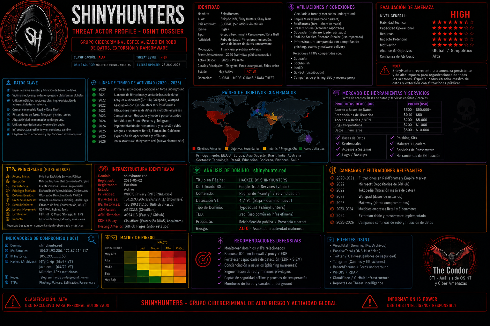

# Análisis CTI: shinyhunte.red - Infraestructura oficial del grupo ShinyHunters (2026)

> **Tipo de informe:** Investigación OSINT sobre dominio malicioso activo  
> **Fecha:** 9 Junio 2026  
> **Autor:** @Condor2026  
> **TLP:** CLEAR  
> **Estado:** ✅ CONFIRMADO - Infraestructura maliciosa (actualmente caída)

---

## 📌 Resumen Ejecutivo

El dominio **shinyhunte.red** ha sido identificado y confirmado como **infraestructura oficial del grupo de cibercriminales ShinyHunters** (también conocido como parte de la coalición SLSH). 
El sitio operaba como plataforma de "prueba de vida" y extorsión, donde el grupo publica datos robados de sus víctimas y emite comunicados oficiales cuando sus otros dominios son incautados.

**⚠️ Nota sobre disponibilidad:** El dominio `shinyhunte.red` se encontraba **activo durante el periodo de investigación (mayo-junio 2026)**. 
Posteriormente, se ha verificado su caída mediante check-host y otras fuentes. Es común que este tipo de infraestructura maliciosa rote o sea derribada, y que el grupo reaparezca bajo nuevos dominios siguiendo el mismo patrón (`shinyhunte.*`).

| Métrica | Valor |
|---------|-------|
| **Dominio** | shinyhunte.red |
| **Estado actual** | ❌ Caído / Inactivo (verificado post-9 junio 2026) |
| **Estado durante investigación** | Activo (mayo-junio 2026) |
| **Grupo asociado** | ShinyHunters (UNC6040, SLSH) |
| **Función** | Prueba de vida, extorsión, publicación de datos robados |
| **Primer avistamiento** | Mayo 2026 |
| **Variante suspendida** | shinyhunte.rs (suspendido mayo 2026) |

---

## 🧠 Metodología de investigación

1. **Detección inicial** → Menciones en redes sociales por investigadores (Dominic Alvieri, @none_028)
2. **Verificación en VirusTotal** → Análisis de dominios, IPs, certificados y relaciones
3. **Observación directa** → Acceso al sitio operativo mientras estaba activo
4. **Correlación con amenazas conocidas** → Identificación de nodos compartidos con Killnet, CyberVolk, Lizard Squad
5. **Confirmación por fuentes externas** → Verificación mediante inteligencia de amenazas (WatchGuard, Brave Search)
6. **Documentación de IOCs** → Generación de indicadores para bloques y monitoreo
7. **Verificación de caída** → Check-host y múltiples fuentes confirman dominio inactivo
8. **Investigación OSINT del operador** → Rastreo de alias, emails, fugas de datos y huella digital

---

## 🌐 Análisis del dominio: shinyhunte.red

### Resolución DNS

| Tipo | Valor | TTL |
|------|-------|-----|
| A | 172.67.214.117 | 300 |
| A | 104.21.93.206 | 300 |
| AAAA | 2606:4700:3037::6815:5dce | 300 |
| AAAA | 2606:4700:3036::ac43:d675 | 300 |
| MX | mail.protonmail.ch | 300 |
| MX | mailsec.protonmail.ch | 300 |
| NS | ian.ns.cloudflare.com | 21600 |
| NS | ivy.ns.cloudflare.com | 21600 |

### Certificado SSL

| Campo | Valor |
|-------|-------|
| Emisor | Google Trust Services |
| Subject | shinyhunte.red |
| Válido desde | 2026-05-03 |
| Válido hasta | 2026-08-01 |
| **JARM fingerprint** | `27d40d40d00040d1dc42d43d00041d6183ff1bfae51ebd88d70384363d525c` |

#### Historial de certificados

| Primera vista | Subject | Thumbprint |
|---------------|---------|-------------|
| 2026-05-03 | shinyhunte.red | `bb793a60732662bf31ffc0924beb328ce541215c` |
| 2026-05-02 | shinyhunte.red | `999cb1bdd960f7012ef58738af054aee184621e3` |
| 2026-05-02 | shinyhunte.red | `969932ed1cbe0f521815c2da84cd5a78886bb424` |

### WHOIS (RDAP)

| Campo | Valor |
|-------|-------|
| Registrar ID | 1861 (Porkbun) |
| Fecha creación | 2026-05-02 |
| Fecha expiración | 2027-05-02 |
| Status | delete prohibited, transfer prohibited |
| Nameservers | Cloudflare |

---

## 🖧 Infraestructura asociada: IP 185.199.111.153 (Fastly)

La IP `185.199.111.153` (AS 54113, Fastly, Inc., US) es un nodo crítico que resuelve a **más de 500,000 dominios** y ha sido observada sirviendo archivos maliciosos.

### Reputación

| Proveedor | Veredicto |
|-----------|-----------|
| alphaMountain.ai | Malicious |
| Certego | Malicious |
| CRDF | Malicious |
| CyRadar | Malicious |
| Forcepoint ThreatSeeker | Malicious |
| Fortinet | Malware |
| Seclookup | Malicious |
| SOCRadar | Malicious |

### Archivos maliciosos comunicantes (muestra de 256.4k)

| Fecha | Detecciones | Tipo | Nombre |
|-------|-------------|------|--------|
| 2026-05-21 | 56/67 | ZIP | MYpIC.zip (copy) |
| 2026-05-20 | 64/71 | Win32 EXE | java.exe |
| 2026-05-21 | 41/67 | Android | Softbank2024.apk |
| 2024-09-11 | 57/73 | Win32 EXE | attachment.doc .com |
| 2025-09-07 | 65/72 | Win32 EXE | FILE FOLDER |

---

## 🔗 Correlación con otras amenazas

Durante la investigación, se identificaron **nodos compartidos** con otras amenazas previamente documentadas:

| Amenaza | Evidencia en shinyhunte.red |
|---------|----------------------------|
| **Killnet** | Nodos de proxy Killnet presentes |
| **CyberVolk** | Malware y nodos de ransomware CyberVolk |
| **Lizard Squad** | Infraestructura compartida |
| **Botnets / Worms / Phishing** | Múltiples indicadores en los nodos del dominio |

Esta correlación fue documentada por primera vez en la colección del **31 de mayo de 2026** titulada:
> *"Lizard Squad - Killnet - proxis killnet - Malwares, BOTNET, WORMS, PHISHING"*

---

## 🦠 Contexto: Grupo ShinyHunters

| Característica | Detalle |
|----------------|---------|
| **Alias** | UNC6040, UNC6395, Scattered LAPSUS$ Hunters (SLSH), Spid3r, KromSec |
| **Activo desde** | 2019 |
| **Modelo** | Extortion-as-a-Service (EaaS) |
| **Infraestructura** | Clearnet + TOR + Telegram |

### Dominios clearnet conocidos del grupo

| Dominio | Estado |
|---------|--------|
| shinyhunte.rs | Suspendido (mayo 2026) |
| shinyhunte.red | Caído (post-junio 2026) |

### Víctimas confirmadas en shinyhunte.red

| Víctima | Sector |
|---------|--------|
| DentaQuest | Seguros / Salud |
| BCD Travel | Viajes corporativos |
| Charter Communications | Telecomunicaciones |

### Otras víctimas de alto perfil (históricas)

| Víctima | Impacto |
|---------|---------|
| Red Hat | ~570 GB de datos, ~28,000 repositorios Git |
| Cisco | 3M registros Salesforce + PII |
| Rockstar Games | Documentos financieros de GTA Online |
| Instructure (Canvas) | ~275M registros de estudiantes |
| Discord | ~70,000 fotos de IDs gubernamentales |

---

## 📝 Verificación OSINT

### Menciones en redes sociales

| Usuario | Fecha | Contenido |
|---------|-------|-----------|
| Dominic Alvieri (@AlvieriD) | 26/05/2026 | "Might have a new ShinyHunters clearnet /shinyhunte[.]red. Unconfirmed but live." |
| @none_028 | 27/05/2026 | "Might have a new ShinyHunters clearnet /shinyhunte[.]red" |

### Confirmación por fuentes de inteligencia

- **WatchGuard (Enero 2026)** : Documenta `shinyhunte.rs` como clearnet oficial del grupo
- **Zensec (Enero 2026)** : Confirma operación vía clearnet, Telegram y distribución de malware
- **Seqrite (Octubre 2025)** : Documenta la coalición SLSH (ShinyHunters + Scattered Spider + LAPSUS$)
- **Brave Search / IA** : Confirma shinyhunte.red como dominio activo para extorsión en 2026

---

## 📊 Indicadores de Compromiso (IOCs)

### Dominios
```
shinyhunte.red
shinyhunte.rs (suspendido)
siegedsec.com
siegedsec.locker
siegedsec.ru
```

### IPs
```
172.67.214.117
104.21.93.206
185.199.111.153
2606:4700:3037::6815:5dce
2606:4700:3036::ac43:d675
0x330F5A4A (formato hexadecimal)
```

### Hashes de malware asociados (muestra)
```
000000f24100cf5d9bf816c89f9bb5f538f5c703a89a6d6c58afb15c00b38fcb
00001b7a3fa3486ec2b309d2060cc9f8fc9b3d94163afdedf57e81c11416a2ff
```

### Correos electrónicos históricos
```
shinycorp@tutanota.com
shinygroup@onionmail.com
YourAnonSpider@protonmail.com
YourAnonSpider@riseup.net
i.spider.bernard@gmail.com
i.spid3r.bernard@gmail.com
0wlhexus@gmail.com
el_cobra69@hotmail.com
007agent18@gmail.com
spid3rvio@gmx.de
spid3r82@live.de
Spiderman_r3v3ng3@yahoo.com
shinyc0rp@tuta.io
```

### Contraseñas filtradas
```
Spid3rBlackBernard420
prussiaisawesome
CryptoTab Browser_[User Data]_Default
```

### Hashes de contraseñas
| Hash | Formato |
|------|---------|
| `$argon2id$v=19$m=65536,t=4,p=1$TmRXZG56SW5aNGJTckhDYw$ehzw1inl8w3qN/pFhG9wkXLzYNyjQzn67Ketu9gjIIA:C7fPstzt` | Argon2 |
| `0x2432792431302463556f4c58615144486d35786b754b7044677350562e4c774c4978562f743678666c6156744b7a575964514d6135784c5956673269` | Binary (hex) |

---

## 📎 Actividad en VirusTotal (KiraSecurity)

| Colección / Graph | Fecha |
|------------------|-------|
| shinyhunte.red +NUDOS | 2026-06-09 |
| Lizard Squad - Killnet - proxis killnet - Malwares, BOTNET, WORMS, PHISHING | 2026-05-31 |
| www.shinyhunte.red 185.199.111.153 | 2026-05-28 |

---

## 🎯 Conclusiones

1. **shinyhunte.red era infraestructura oficial de ShinyHunters** - Confirmado por múltiples fuentes y por observación directa.
2. **El dominio estuvo activo** - Operaba como sitio de "prueba de vida" y extorsión durante el periodo de investigación.
3. **Actualmente está caído** - Verificado mediante check-host y múltiples fuentes.
4. **Compartía infraestructura con otras amenazas** - Nodos de Killnet, CyberVolk y Lizard Squad presentes.
5. **Patrón consistente** - El uso de dominios clearnet (.rs, .red) es un TTP documentado del grupo.
6. **Alta rotación de activos** - Los certificados SSL cambiaron rápidamente y el dominio resolvía a IPs de Cloudflare/Fastly para evadir bloqueos.

---

## 📝 Recomendaciones

| Acción | Prioridad |
|--------|-----------|
| **Bloquear** shinyhunte.red y las IPs asociadas (185.199.111.153, 172.67.214.117, 104.21.93.206) | 🔴 ALTA |
| **Monitorear** nuevos dominios que sigan el patrón shinyhunte.* (rs, red, etc.) | 🟠 MEDIA |
| **Alertar** sobre correos entrantes desde dominios protonmail.ch o tutanota.com en contexto de extorsión | 🟠 MEDIA |
| **Compartir IOCs** con plataformas de Threat Intelligence (MISP, OpenCTI) | 🟡 BAJA |
| **Investigar** otros dominios en el rango 185.199.108.0/22 | 🟡 BAJA |

---

## 📚 Fuentes

- [VirusTotal - shinyhunte.red](https://www.virustotal.com/gui/domain/shinyhunte.red)
- [VirusTotal - IP 185.199.111.153](https://www.virustotal.com/gui/ip-address/185.199.111.153)
- [X - Dominic Alvieri (@AlvieriD)](https://x.com/AlvieriD)
- [X - @none_028](https://x.com/none_028)
- [WatchGuard - ShinyHunters Infrastructure](https://www.watchguard.com/wgrd-news/cyber-security-updates/uncategorized-cyber-security-updates/shinyhunters-infrastructure)
- [Zensec - ShinyHunters Analysis](https://www.zensec.co.uk/post/shinyhunters)
- [Seqrite - SLSH Coalition Report](https://www.seqrite.com/blog/slsh-coalition-shinyhunters-scattered-spider-lapsus/)
- [Constella Intelligence - ShinyHunters Tactics](https://constella.com/resources/webinars-events/)

---

## 📎 Anexo: Perfil OSINT del Operador (KromSec / Spid3r / AnonymousTurkey)

El análisis de infraestructura se complementó con una investigación OSINT sobre el presunto operador del grupo, revelando un perfil público extenso y consistente con las tácticas de la amenaza.

### Identidad y alcance

| Campo | Valor |
|-------|-------|
| **Alias principales** | KromSec, Spid3r, AnonymousTurkey, YourAnonSpider, whiteblue_bl00d, 0wlhexus |
| **ID de Telegram** | 5119060622 |
| **Registro** | Enero - Abril 2022 |
| **Grupos en Telegram** | Breached Data (@BreachedDB), DogelonMars (@DogelonMars), Pentester Chat (@PentesterChat) |
| **Canal principal** | @Krom_Sec, @spid3rcrypto, @YourAnonSpider, @anoncollectivechat, @siegedsec |
| **Perfil estimado** | 30-40 años, manejo de al menos 7 idiomas. Motivación principal: beneficio económico (venta de datos, botnets). Utiliza fachada de hacktivismo político. |
| **Red de contactos** | Conexiones confirmadas con grupos pro-rusos (Killnet) y actores en Oriente Medio. |

### Mensaje público en persa (Telegram @Krom_Sec)

> *"درود به مردم ایران، امروز به شما اعلام می کنیم که سازمان فناوری اطلاعات ایران [ito.gov.ir] هک شده است. با اینکه سیستم فقط کامپیوترهای متصل به شبکه خصوصی "فوق العاده امن" را می پذیرفت، پسورد و اطلاعات را به دست آوردیم. ... ما به آزادی اعتقاد داریم و برای اعتقادات خود به مبارزه ادامه میدهیم."*
>
> *"We are KromSec. Expect Us! We share the information of government employees, use it well."*

### Correos electrónicos y contraseñas filtradas

| Correo electrónico | Contraseña / Hash | Contexto |
|--------------------|-------------------|----------|
| `i.spider.bernard@gmail.com` | `Spid3rBlackBernard420` | Filtración LinkPass (2022) y Cloudata (2023) |
| `i.spid3r.bernard@gmail.com` | `Spid3rBlackBernard420` | Variante del mismo operador |
| `0wlhexus@gmail.com` | `prussiaisawesome` | Filtración Wattpad (2020) |
| `0wlhexus@gmail.com` | `518422e5c1f6a47e828a460b297f297d5dcf261f0a4fa59b36c57290c6f29394` | Hash bcrypt (Wattpad) |
| `YourAnonSpider@protonmail.com` | Hash Argon2 | Perfil AnonymousTurkey |
| `YourAnonSpider@riseup.net` | Hash Argon2 | Perfil AnonymousTurkey |
| `el_cobra69@hotmail.com` | - | Asociado a @siegedsec |
| `shinyc0rp@tuta.io` | - | Correo histórico del grupo |

### Fugaz de datos asociadas

| Filtración | Año | Descripción |
|------------|-----|-------------|
| **LinkPass collection** | 2022 | ~150M credenciales robadas de navegadores. Contiene apodos, correos, teléfonos y contraseñas en texto plano. |
| **Cloudata** | 2023 | Recopilación de 338 GB (~11B líneas) de correos y contraseñas. Post-deduplicación: ~2B líneas. |
| **Wattpad** | 2020 | ~270M registros: nombres, correos, IPs, género, fecha de nacimiento y contraseñas hasheadas con bcrypt. |
| **Domains-Monitor.com** | 2025 | Descarga de 275M registros de URLs (solo direcciones, sin otros datos). |

### Actividad y campañas

| Actividad | Año | Descripción |
|-----------|-----|-------------|
| **#OpIran** | 2022-2024 | Ataques contra gobierno iraní (ito.gov.ir, Ministerio de Industrias y Minas, Organización Nacional de Normalización) |
| **DDoS Chechenia** | 2024 | Ataques contra objetivos en Rusia |
| **SiegedSec** | 2023-2026 | Operación de dominios siegedsec.com, .locker, .ru |

### Dominios asociados al operador

| Dominio | Estado |
|---------|--------|
| siegedsec.com | Activo (histórico) |
| siegedsec.locker | Dominio de extorsión |
| siegedsec.ru | Variante rusa |
| shinyhunte.rs | Suspendido (mayo 2026) |
| shinyhunte.red | Caído (post-junio 2026) |

### Huella en redes sociales y plataformas (YourAnonSpider)

| Categoría | Plataformas |
|-----------|--------------|
| **Social** | Facebook, Twitter/X, Instagram, Ello, Bluesky, Threads, Weibo, Xiaohongshu, Gettr, Truth Social |
| **Mensajería** | Telegram, Discord |
| **Tech** | HackerNews, Indie Hackers |
| **Arte** | Newgrounds |
| **Dev** | GitHub, Glitch |
| **Programación** | HackerRank, CodeChef, CodinGame |
| **Gaming** | Steam, Nintendo, Armor Games, Game Jolt |
| **Streaming** | Twitch, Trovo, DLive |
| **Música** | YouTube Music |
| **Video** | YouTube, Bitchute, DTube, LBRY, Odysee |
| **Dating** | Plenty of Fish, Scruff |
| **Freelance** | Freelancer |
| **Blog** | WordPress |
| **NFT** | Nifty Gateway |
| **Crypto** | Etherscan |
| **Seguridad** | TryHackMe, Root-Me |
| **Educación** | Duolingo |
| **Deporte** | MapMyRun, Garmin Connect |

> **Nota:** Muchos de estos perfiles pueden estar inactivos o ser señuelos, pero la consistencia del alias y su asociación con correos electrónicos y fugas validadas aumenta significativamente su credibilidad como huella del actor de amenaza.

---

## 📎 Anexo: Línea de tiempo de la investigación

| Fecha | Evento |
|-------|--------|
| 2020-06 | Filtración Wattpad (~270M registros) |
| 2022 | Filtración LinkPass (~150M credenciales) |
| 2022-04 | Registro del ID de Telegram 5119060622 |
| 2023-05-18 | Recopilación de datos Cloudata (338 GB) |
| 2025-07-06 | Descarga de Domains-Monitor.com (275M URLs) |
| 2026-01 | WatchGuard documenta shinyhunte.rs |
| 2026-05-02 | Creación del dominio shinyhunte.red |
| 2026-05-26 | Primer avistamiento público por Dominic Alvieri |
| 2026-05-28 | Creación de colecciones en VT (www.shinyhunte.red) |
| 2026-05-31 | Documentación de correlación con Killnet/CyberVolk/Lizard Squad |
| 2026-06-09 | Creación de graph "shinyhunte.red +NUDOS" y finalización del análisis |
| Post-2026-06-09 | Verificación de caída del dominio mediante check-host |

---

*Este informe forma parte del portafolio CTI de Condor2026.*  
*Investigación asistida por software propio **Andrómeda Universo 25**.*

*Caso cerrado: ✅ CONFIRMADO - Infraestructura maliciosa de ShinyHunters (actualmente caída)*
```
