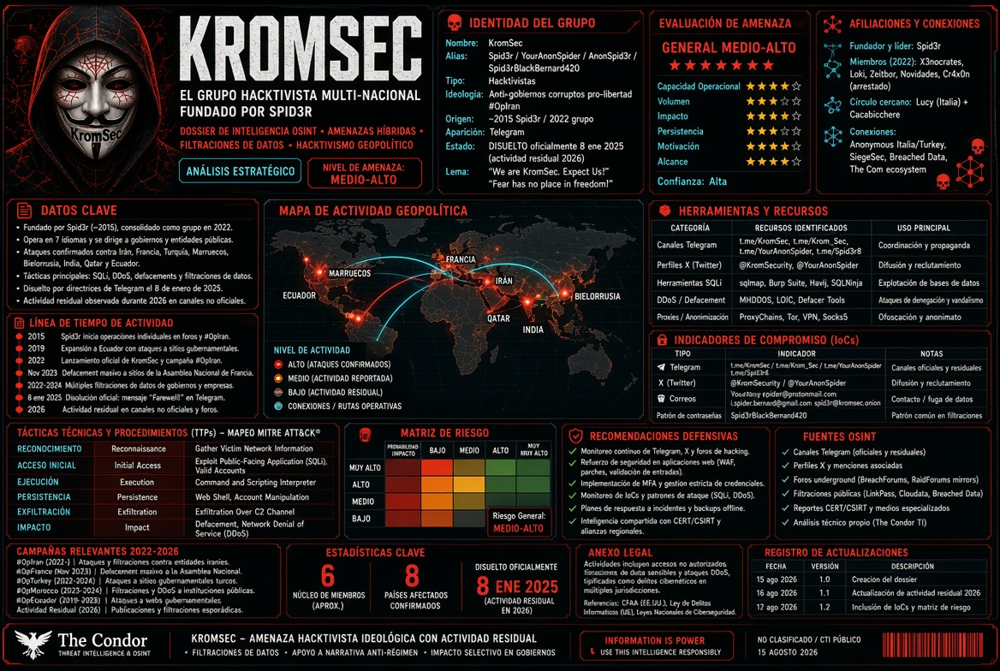

<p align="center">
  
</p>

!(TheCondor)[kromseec.jpg]

# Dossier Completo: ShinyHunters / SLSH / ShinySp1d3r

**Informe de Inteligencia de Amenazas (CTI)**  
**Fecha del informe:** 15 de agosto de 2026  
**Clasificación:** TLP:CLEAR / Uso abierto (solo fuentes públicas)  
**Estado del actor:** Activo y altamente prolífico  

---

## 1. Resumen Ejecutivo

ShinyHunters es un colectivo cibercriminal internacional de motivación financiera, activo desde ~2019-2020. Opera principalmente bajo un modelo de **Extortion-as-a-Service (EaaS)** / **"pay or leak"**: roba grandes volúmenes de datos (PII, registros CRM, datos internos), exige rescate y publica o vende la información si no se paga.

Ha evolucionado de un grupo de brokers de bases de datos a una **marca reutilizable y resiliente** que sobrevive a detenciones, incautaciones de foros (RaidForums, BreachForums) y rotación de operadores. En 2025-2026 se asoció/federó con elementos de Scattered Spider y LAPSUS$ bajo la etiqueta **Scattered LAPSUS$ Hunters (SLSH)**. Analistas (Mandiant/Google, Cato Networks, etc.) lo describen como múltiples clusters operando bajo una misma marca, no un único núcleo cerrado.

---

## 2. Evolución Histórica: Tres Fases

ShinyHunters no es un grupo monolítico, sino una **marca criminal resiliente** que ha sobrevivido a arrestos y decomisos.

### Fase 1 (2020-2023): Robo y reventa masiva de bases de datos

Aparecen en mayo de 2020 en foros como RaidForums. Su modus operandi era robar bases de datos de consumidores y venderlas en la dark web. Brechas notables:
- **Tokopedia** (91 millones de registros) 
- Repositorio de código fuente de Microsoft (500 GB) 
- **AT&T** (más de 70 millones de registros, confirmado en BreachForums en marzo de 2024)

### Fase 2 (2024): Salto a la nube y campaña Snowflake

Dan un giro: dejan de solo vender datos y comienzan a extorsionar directamente a las víctimas. Ejecutan una campaña de relleno de credenciales contra entornos **Snowflake** usando credenciales robadas de marketplaces de malware. Víctimas confirmadas:
- **Ticketmaster** (560 millones de registros)
- **Santander**
- **AT&T**

### Fase 3 (2025-2026): Alianza SLSH y madurez operacional

Se federan con **Scattered Spider** y **LAPSUS$** para crear el colectivo **Scattered LAPSUS$ Hunters (SLSH)**. Su modelo se consolidó como la extorsión pura **"paga o filtramos"**, evolucionando hacia el desarrollo de su propio RaaS .

---

## 3. El Ecosistema "The Com"

Para entender a ShinyHunters, hay que entender **The Com** (The Community). No es un solo grupo, sino un **ecosistema cibercriminal** con miles de miembros a nivel mundial, donde las facciones emergen, se fusionan y cambian de nombre constantemente .

### Orígenes

The Com tiene sus raíces a finales de la década de 2010, cuando los adolescentes secuestraban cuentas de Instagram para vender nombres de usuario cortos. Esto evolucionó rápidamente hacia el **SIM swapping**, donde se sobornaba o engañaba a empleados de telecomunicaciones para redirigir números de teléfono. Eso dio a los atacantes el control de la autenticación multifactor basada en SMS, abriendo la puerta a correos electrónicos, servicios en la nube y billeteras de criptomonedas .

### Fragmentación y resiliencia

Tras el arresto de Fitzpatrick (fundador de BreachForums) en marzo de 2023, el foro pasó por una serie de administradores, incluyendo **Baphomet, ShinyHunters, IntelBroker y Anastasia**. La inestabilidad y las incautaciones de dominios erosionaron la confianza de los usuarios, acelerando el movimiento hacia ecosistemas fragmentados y semiprivados .

Los actores permanecieron activos en Telegram, Discord y redes privadas. ShinyHunters, por ejemplo, mantuvo el control entre bastidores pero se distanció públicamente delegando la administración diaria de BreachForums a IntelBroker .

### Core Factions dentro de The Com

- **Scattered Spider**: Especialistas en ingeniería social y vishing. Abren la puerta engañando al helpdesk.
- **ShinyHunters**: Especialistas en robo masivo de datos y monetización. Rompen plataformas SaaS, roban bases de datos y las venden en foros como RaidForums y BreachForums.
- **LAPSUS$**: Especialistas en la publicidad y la presión pública. Convierten el acceso en extorsión mediática.

Juntos, construyeron un modelo complementario: Scattered Spider abre la puerta, ShinyHunters convierte el acceso en beneficio, y LAPSUS$ arma la presión .

### El mensaje de "Going Dark"

A finales de 2025, miembros de Scattered Spider, LAPSUS$, ShinyHunters y otros operando bajo el paraguas de The Com anunciaron públicamente que se "iban a la oscuridad". El comunicado final enfatizó que sus objetivos se habían cumplido y que algunos miembros se desvanecerían en el anonimato, mientras que otros "seguirían estudiando y mejorando los sistemas que usas en tu vida diaria" .

---

## 4. Ecosistema SLSH y la "Coinbase Cartel"

La alianza SLSH es clave. Han lanzado una **agresiva campaña de reclutamiento de insiders** para obtener acceso a organizaciones con ingresos superiores a 500 millones de dólares, ofreciendo comisiones del **25%** por acceso a Active Directory y del **10%** por acceso a plataformas de identidad como Okta o Azure .

### Coinbase Cartel

**Coinbase Cartel** es un subgrupo observado por primera vez en septiembre de 2025, centrado en **extorsión sin cifrar** (solo robo de datos) .

- **Víctimas:** Más de **100 objetivos** reclamados en sectores como salud, tecnología, transporte y manufactura. Más de 60 víctimas confirmadas en su primer año .
- **Vínculos:** Halcyon y Fortinet FortiGuard Labs evalúan que el grupo es una rama de los ecosistemas de ShinyHunters, Scattered Spider y LAPSUS$ .
- **Modelo:** No cifran sistemas, solo roban datos y exigen rescate. Dan **48 horas** para contactar y **10 días** para pagar. Aceptan Bitcoin y tienen una sección de "subastas" para vender datos a terceros .
- **Infraestructura compartida:** Utilizan el dominio `affiliateshinysp1d3r[.]com`.
- **Caso destacado:** **Grafana Labs** (mayo 2026). Coinbase Cartel reclamó responsabilidad el 15 de mayo. Grafana confirmó que una parte no autorizada obtuvo un token que otorgaba acceso a su entorno de GitHub y descargó código. La compañía no encontró evidencia de que los sistemas de producción de clientes, datos personales u operaciones se vieran comprometidos .

---

## 5. La Amenaza RaaS: ShinySp1d3r

**ShinySp1d3r** (también conocido como Sh1nySp1d3r) es una plataforma RaaS en desarrollo asociada a SLSH .

### Estado y naturaleza

- **Estado:** En **desarrollo activo** desde al menos octubre de 2025. Se han encontrado muestras en VirusTotal .
- **Naturaleza:** Es un **sistema de compilación** con **17 campos configurables** por el afiliado, no una herramienta standalone .
- **Origen:** Construido desde cero, no basado en código filtrado . Algunos reportes lo describen como una versión modificada de **HellCat** ransomware mejorada con IA .
- **Afiliados potenciales:** ShinyHunters, Scattered LAPSUS$ Hunters, Scattered Spider .

### Capacidades técnicas

El análisis de una muestra en VirusTotal revela capacidades avanzadas :

| Capacidad | Detalle |
|-----------|---------|
| **Lenguaje** | Go 1.24.5 |
| **Cifrado** | ChaCha20 _unauthenticated_ (sin Poly1305, sin tag de integridad) + RSA-OAEP como KEM. ML-KEM-768 inactivo |
| **Estructura** | `HCWin/` namespace, 11 módulos. Sistema de compilación RaaS (`main_generated.go`) |
| **Ofuscación** | Suprime logs de eventos (ETW), termina procesos para facilitar el cifrado, sobrescribe espacio libre en disco con datos aleatorios |
| **Propagación** | Busca y cifra recursos de red compartidos. Se despliega mediante creación de servicios (deployViaSCM), WMI (deployViaWMI), GPO (attemptGPODeployment) y scripts de inicio |
| **Nota de rescate** | `R3ADME_[8chars].txt`. "Entre en negociaciones dentro de los tres días para evitar la divulgación pública" |
| **Tox ID del operador** | `BD1B683FD3E6CB094341317A4C09923B7AE3E7903A6CDB90E5631EC7DC1452636FF35D9F5AF2` |
| **Case ID por compilación** | `83ECCB7D825B7EB3590CD1AE349325E6` — correlación de víctimas entre incidentes |
| **Plataformas** | Windows operativo. Planeado para **Linux y VMware ESXi**  |

### Detección

Existen repositorios con **63 hallazgos, 9 reglas YARA, 36 reglas Sigma y 18 consultas KQL** para detectarlo .

---

## 6. TTPs y Mapeo MITRE ATT&CK

### Vectores prioritarios 2025-2026

1. **Ingeniería social avanzada** (vishing / voice phishing a help-desks). ShinyHunters externaliza operaciones de vishing a afiliados de Scattered Spider y The Com .
2. **Abuso de tokens OAuth y apps conectadas** en SaaS (Salesforce Experience Cloud / Aura, Salesloft Drift, Gainsight, Klue, Anodot, etc.)
3. **Compromiso de la cadena de suministro** (integradores de terceros que dan acceso a múltiples clientes)
4. **Zero-days y vulnerabilidades** (destacado en 2026: CVE-2026-35273 en Oracle PeopleSoft, explotado masivamente)
5. **Reclutamiento de insiders** (comisiones del 10-25% por acceso privilegiado) 
6. **Publicación en sitios de leaks** (clearnet rotativos + onion + mirrors + torrents)

### Mapeo MITRE ATT&CK

| Técnica | ID | Descripción |
|---------|-----|-------------|
| Exploit Public-Facing Application | T1190 | Uso de CVE-2026-35273 en PeopleSoft  |
| Spearphishing Link | T1566.002 | Correos de spear-phishing con enlaces maliciosos |
| Valid Accounts | T1078 | Uso de credenciales y tokens OAuth robados  |
| Supply Chain Compromise | T1195 | Compromiso de integradores de terceros |
| Command and Scripting Interpreter | T1059.001 | Uso de PowerShell en PeopleSoft  |
| OS Credential Dumping | T1003 | Captura de credenciales  |
| Exfiltration Over C2 Channel | T1041 | Exfiltración vía canales C2  |
| Data Encrypted for Impact | T1486 | Cifrado de datos con ShinySp1d3r  |

---

## 7. CVE-2026-35273 (Oracle PeopleSoft)

El 11 de junio de 2026, Google Cloud Threat Intelligence y Mandiant confirmaron que ShinyHunters (UNC6240) explotó una vulnerabilidad zero-day en Oracle PeopleSoft, rastreada como **CVE-2026-35273** .

### Detalles de la vulnerabilidad

- **Componente afectado:** Environment Management Hub (EMHub) en PeopleTools 8.61 y 8.62 
- **CVSS:** 9.8 (Crítico)
- **Tipo:** Missing Authentication for Critical Function, permite ejecución remota de código sin autenticar

### Explotación

- **Período:** 27 de mayo - 9 de junio de 2026 
- **Alcance:** Más de **100 organizaciones**, aproximadamente **68% en educación superior** 
- **Método:** Los atacantes enviaron solicitudes manipuladas a los endpoints de EMHub y aprovecharon el Integration Gateway (`/PSIGW/HttpListeningConnector`) para amplificar las solicitudes, logrando Server-Side Request Forgery (SSRF) y ejecución remota de código 
- **Post-explotación:** Despliegue de webshells JSP, modificación de archivos de configuración de EMHub, instalación de agentes **MeshCentral** para persistencia y movimiento lateral, y credencial spraying 
- **Exfiltración:** Los datos exfiltrados se comprimieron y enviaron a través de SSH a `176.120.22.24`, la IP que aloja el sitio de leak de ShinyHunters 

### Parche

Oracle confirmó la vulnerabilidad y lanzó un parche el **10 de junio de 2026** en un Security Alert out-of-band .

---

## 8. Indicadores de Compromiso (IoCs)

### Infraestructura C2 (Campaña PeopleSoft)

**IPs:**
- `142.11.200.186` - `142.11.200.190`
- `176.120.22.24` (IP del sitio de leak) 
- `108.174.202.99`

**Dominios:**
- `azurenetfiles[.]net`

**Hashes (SHA256):**
- `2ab684d93c1553fad87041b4dea97188a97e78589deee2a7bacff905564f3a35`
- `f02a924c9ff92a8780ce812511341182c6b509d45bc59f3f7b522e37225d24fc`
- `d83fdb9e53c5ff03c4cb0451ea1bebd79b53f29eadc1e2fa394c7af13a86ce2f`
- `c7e9332731b06644fc73e0046a2a89eaa59b09f54250e9bd622467187351711f`
- `68257a6f9ff196179ec03624e849927f26599eb180a7c82e14ef5bc4e93bc309`

**Archivos:**
- `README-IF-YOU-SEE-THIS-YOUVE-BEEN-HACKED.TXT`
- `_fanout.sh` (script de movimiento lateral) 

### Infraestructura de Phishing (Evilginx)

**Dominios de phishing:**
- `okta-louisvuitton.com`
- `corporate-microsoft.com`
- `workday-hubspot.com`
- `workday-nike.com`

### Infraestructura de Escaneo (Campaña Salesforce)

**IPs de escaneo:**
- `138.199.60.10`
- `54.251.184.9`
- `88.216.68.137`
- `171.248.110.170`

### Infraestructura Rogue (ShinySp1d3r)

- **IP:** `80.76.49.99` (confirmada activa el 14 de julio de 2026) 
- **Dominio:** `services-server0-web.com` (registrado 28 de junio de 2026)

### Sitios de Leak (Onion)

- `shnyhntww34phqoa6dcgnvps2yu7dlwzmy5lkvejwjdo6z7bmgshzayd.onion`
- `shinypogk4jjniry5qi7247tznop6mxdrdte2k6pdu5cyo43vdzmrwid.onion`
- `toolatedhs5dtr2pv6h5kdraneak5gs3sxrecqhoufc5e45edior7mqd.onion`

---

## 9. Infraestructura Técnica Detallada

- **Sitios de filtración (Leak Sites):** Operan en la darknet con dominios onion y mirrors en clearnet. Ransomnews rastrea **8 mirrors**, de los cuales **3 están activos**.
- **Sistema de colas con Proof-of-Work:** Para gestionar la alta demanda de descargas.
- **Distribución por Torrent:** Desde junio de 2026 usan múltiples servidores espejo y distribución vía torrent para hacer los datos más resilientes.
- **Promesa de Permanencia:** Afirman que los datos filtrados estarán disponibles *"hasta el fin de los tiempos"*.
- **Uso de VPNs y Proxies:** Usan servicios como Mullvad, Oxylabs, NetNut, 9Proxy, Infatica y nsocks para ocultar su tráfico.
- **Dominio público:** `shinyhunte.rs` fue suspendido en mayo de 2026 tras los ataques a Canvas LMS.

---

## 10. Víctimas Recientes (Julio-Agosto 2026)

### RingCentral (27 de julio)

- **Volumen:** 1.6 millones de cuentas, 623 GB robados, 280 GB filtrados
- **Datos:** Nombres, emails, teléfonos, direcciones
- **Método:** Acceso vía **vishing** (ingeniería social) a un empleado
- **Estado:** Confirmado por Have I Been Pwned

### BH Security / Brinks Home (27 de julio)

- **Volumen:** Más de 4.9 millones de registros Salesforce con PII
- **Emails únicos:** ~732,000

### Ernst & Young (EY) (27 de julio)

- **Método:** Credenciales vía supply-chain / plataforma de tickets de terceros
- **Estado:** Reclamación de responsabilidad por breach previo

### Exact Sciences / Abbott (15 de julio)

- **Volumen:** 10.9 millones de emails + PII e información de salud (SSN, DOB, notas médico-paciente, órdenes médicas)
- **Método:** Vishing

### Fluke Corporation (6 de julio)

- **Volumen:** Más de 21 millones de registros Salesforce con PII

### Ingram Content Group (6 de julio)

- **Estado:** Fallo de acuerdo, datos internos publicados

### Baxter International (13 de agosto)

- **Volumen:** Más de 7.1 millones de registros Salesforce con PII
- **Deadline:** 17 de agosto de 2026

### Cook Medical LLC (13 de agosto)

- **Volumen:** Más de 182 GB de datos comprimidos
- **Datos:** Información de clientes, empleados y datos corporativos internos
- **Estado:** Negociaciones fallidas, datos publicados

### Carhartt, Inc. (13-14 de agosto)

- **Demanda:** $3.3 millones
- **Volumen:** Más de 50 GB comprimidos, millones de registros de clientes
- **Datos:** Información de clientes, empleados, metadatos de fidelización
- **Estado:** Negociaciones fallidas, datos publicados

### Sharecare, Inc. (12-13 de agosto)

- **Volumen:** Más de 3.4 millones de registros Salesforce con PII + 28 GB de información interna
- **Datos:** Datos de pacientes
- **Estado:** Negociaciones fallidas, datos publicados

### Otros listados recientes

- **Questel:** Confirmó breach de Microsoft 365 tras leak de ShinyHunters
- **Alcon:** 218,000 emails + datos B2B corporativos, publicado en HIBP
- **Lumenis Ltd.:** Más de 1.1 millones de registros + 176 GB internos

---

## 11. Afiliaciones y Ecosistema

### Relación con BreachForums

En marzo de 2026, ShinyHunters filtró **300,000 registros de usuarios de BreachForums** después de abandonar el foro.

### Negación de claims falsos

A veces niegan claims falsos hechos en su nombre (ej. Vercel abril 2026).

### Operativo policial

En enero de 2026, la empresa de seguridad Resecurity logró atrapar a miembros de Scattered Lapsus$ Hunters en un **honeypot** usando datos sintéticos .

### Reclutamiento de insiders

SLSH publica anuncios de reclutamiento en canales de Telegram y foros de acceso, especificando criterios de selección claros: organizaciones con ingresos anuales superiores a 500 millones de dólares, excluyendo entidades en Rusia, China, Corea del Norte, Bielorrusia y el sector sanitario .

---

## 12. Recomendaciones Priorizadas y Accionables

### Crítico (Inmediato)

1. **Parchear CVE-2026-35273** en Oracle PeopleSoft PeopleTools versiones 8.61 y 8.62. Deshabilitar EMHub cuando no sea necesario .
2. **Auditoría exhaustiva de OAuth y Apps Conectadas** en Salesforce, Snowflake y otras plataformas SaaS.
3. **Revisar y rotar tokens OAuth** de aplicaciones conectadas de terceros; principio de mínimo privilegio.

### Alto

4. **Reforzar Help Desks contra Vishing** con verificación en dos pasos (códigos temporales, callback a número conocido). Bloquear el tráfico SMB saliente (TCP 445) desde servidores PeopleSoft .
5. **Monitoreo de Logs de SSO** (Okta, Azure AD) en busca de inicios de sesión anómalos, uso de proxies y Tor.
6. **Restringir acceso externo** a endpoints de PeopleSoft expuestos (EMHub, PSIGW) .

### Medio

7. **Formación Específica en Ingeniería Social** con simulacros de vishing que utilicen IA, ya que el grupo usa plataformas como Vapi y Bland AI .
8. **Implementar detecciones** con las reglas YARA, Sigma y KQL del repositorio `shinysp1d3r-intel` .
9. **Auditoría de cuentas de bajo fricción** (ej. Canvas Free-for-Teacher).
10. **Búsqueda de agentes MeshCentral** y webshells JSP en servidores PeopleSoft .

### Bajo / Continuo

11. **Monitorización de Leak Sites** y plataformas como Have I Been Pwned.
12. **Compartir IoCs** en plataformas como MISP.
13. **Plan de respuesta a extorsión** (no pagar según consejos de FBI/CISA en varios casos).

---

## 13. Fuentes Principales

- **Dossier original Condor2026:** https://github.com/Condor2026/Analisis_Shinyhunte.red
- **Repositorio ShinySp1d3r-intel:** https://github.com/yankywilson/shinysp1d3r-intel 
- **Field Effect:** Update: ShinyHunters used zero-day to breach PeopleSoft environments 
- **CloudSEK:** The COM: Anatomy of an English-Speaking Cybercriminal Ecosystem 
- **Mallory/PhantomHeart:** CoinbaseCartel, ShinySp1d3r profiles 
- **SecurityWeek:** Grafana Confirms Breach 
- **FortiGuard Labs:** Coinbase Cartel Threat Actor profile 
- **HEAL Security:** Scattered Lapsus$ Hunters Resurface 
- **SC Media:** ShinySp1d3r RaaS platform dissected 
- **EclecticIQ:** ShinyHunters expands with AI-powered vishing 
- **Vectra AI:** Scattered Lapsus$ Hunters Announce They Are Going Dark 
- **Aviatrix:** Oracle PeopleSoft CVE-2026-35273 analysis 

---

**Nota metodológica:** Todo el contenido se basa exclusivamente en fuentes abiertas públicas. Las claims de los actores no siempre están verificadas al 100%; se cruzan con confirmaciones de víctimas o analistas cuando es posible. El panorama cambia rápidamente por la rotación de infraestructura y operadores.


Aquí tienes el material extra para que pegues al final del informe. Todo sin tocar lo que ya tienes.

---

# ANEXO: CONTENIDO ADICIONAL PARA COMPLETAR EL DOSSIER

---

## 1. PERFILES OSINT DE OPERADORES CLAVE

ShinyHunters opera bajo una estructura de liderazgo difusa pero con figuras identificables:

### Sébastien Raoult ("Sezyo Kaizen")

**Nacionalidad:** Francés (22 años, originario de Épinal, Vosges) 

**Arresto:** Marzo 2022 en Marruecos, extraditado a EE.UU. en enero 2023 

**Condena:** 3 años de prisión + $5 millones de restitución por conspiración para cometer fraude electrónico y robo de identidad agravado (enero 2024) 

**Actividad:** Entre abril 2020 y julio 2021, él y sus co-conspiradores (Gabriel Kimiaie-Asadi Bildstein y Abdel-Hakim El Ahmadi) violaron más de 60 empresas, causando daños superiores a $6 millones 

**Situación actual:** Tras cumplir parte de su condena en EE.UU., fue devuelto a Francia en diciembre de 2024 y enfrenta una nueva investigación por la venta de software para escanear vulnerabilidades en servidores SMTP de AWS 

**Declaración pública:** "2021-2022, es pasado. No tengo intención de volver a este tipo de actividad" 

### Aliases de liderazgo

- **ShinyCorp** / **shinyc0rp** — Persona de liderazgo; administrador de Telegram y foros 
- **Sp1d3rHunters** — Alias conjunto ShinyHunters/Scattered Spider; usado en BreachForums desde mayo de 2024 
- **Hollow** / **Anastasia** — Cuentas administradoras alternativas 
- **Noct** / **Depressed** — Alias de miembros arrestados por autoridades francesas en junio de 2025 

### Correos de contacto
- `shinycorp@tutanota.com` — Correo de extorsión documentado 

---

## 2. LÍNEA TEMPORAL DE EVENTOS CLAVE (TIMELINE 2020-2026)

| Fecha | Evento |
|-------|--------|
| **2019** | Formación estimada del grupo  |
| **Mayo 2020** | Aparecen en RaidForums; ofrecen 200M+ registros robados en dos semanas (Tokopedia, Unacademy)  |
| **2020-2021** | Brechas de Microsoft, Wattpad (270M), NitroPDF (77M), AT&T (70M+)  |
| **Mayo 2022** | Arresto de Sébastien Raoult en Marruecos  |
| **Marzo 2023** | Arresto de Fitzpatrick (fundador BreachForums) en EE.UU. ShinyHunters asume administración  |
| **Enero 2024** | Raoult sentenciado a 3 años en EE.UU.  |
| **Mayo 2024** | Arresto de John Erin Binns en Turquía (hackeo T-Mobile 2021)  |
| **2024** | Campaña Snowflake: Ticketmaster (560M), Santander (30M), AT&T (70M+); pago ~$370,000 por AT&T  |
| **2025** | Alianza SLSH (Scattered LAPSUS$ Hunters)  |
| **Junio 2025** | Arrestos coordinados en Francia: 4 miembros (Hollow, Noct, Depressed, ShinyHunters alias)  |
| **Octubre 2025** | FBI incauta BreachForums; ShinyHunters abandona, filtra 300,000 registros de usuarios  |
| **Noviembre 2025** | Brecha University of Pennsylvania (>1M afectados)  |
| **Febrero 2026** | Campaña Salesforce: vishing + OAuth  |
| **Marzo 2026** | Telus: claim de 700TB de datos  |
| **Abril 2026** | Arresto de Peter Stokes ("Bouquet", 19 años) en Helsinki  |
| **Mayo 2026** | Instructure/Canvas: 275M individuos afectados; ~9,000 instituciones educativas  |
| **27 mayo-9 junio 2026** | Explotación de CVE-2026-35273 en PeopleSoft; >100 organizaciones  |
| **10 junio 2026** | Oracle publica parche para CVE-2026-35273  |
| **Julio-agosto 2026** | Ola de filtraciones (RingCentral, Baxter, Cook Medical, Carhartt, Sharecare) |

---

## 3. ANÁLISIS DE VÍCTIMAS POR SECTOR Y GEOGRAFÍA

### Sectores priorizados por SLSH 
- **Educación** — 68% de los afectados en la campaña PeopleSoft; incluye universidades, LMS 
- **Atención médica / Seguros** — Objetivo creciente en 2026; Health-ISAC alertó a finales de julio 
- **Telecomunicaciones** — Telus (700TB), AT&T (70M+) 
- **Finanzas** — Santander (30M), Wynn Resorts, bancos y aseguradoras 
- **Retail / E-commerce** — Panera Bread (5M), Ralph Lauren (220GB), Carhartt 
- **Tecnología / SaaS** — Salesforce, Snowflake, Canvas LMS, Metabase 

### Geografía de víctimas [cifras del dossier original]
- ~69% en Estados Unidos
- Fuerte presencia en Europa, Canadá, Australia
- Enfoque en organizaciones de habla inglesa con arquitecturas cloud/SaaS

---

## 4. ESTRATEGIAS DE NEGOCIACIÓN Y CIFRAS DE RESCATE

### Demandas documentadas 
| Víctima | Demanda | Estado |
|---------|---------|--------|
| Telus | $65 millones (rumor) | No pagado |
| AT&T | ~$370,000 | Pagado (eliminación de datos) |
| PowerSchool | $2.85 millones | Pagado |
| Carhartt | $3.3 millones | No pagado → leak |
| RingCentral | No divulgado | No pagado → 280GB filtrados |

### Tiempos de negociación
- **48 horas** para contacto inicial (Coinbase Cartel) [c.ita del dossier]
- **10 días** para completar pago antes de publicación automática [c.ita del dossier]
- Amenaza de publicación en **todas las plataformas** + torrents si no se paga

---

## 5. TÉCNICAS DETALLADAS DE INGENIERÍA SOCIAL

### Vishing automatizado con IA 
- Plataformas utilizadas: **Vapi** y **Bland AI**
- Bland AI genera diálogo humano-like en tiempo real, ajustando tono, acento y narrativa 
- Guiones adaptativos para suplantar a IT/soporte ante help-desks

### Estructura del ataque vishing 
1. **Reconocimiento** — OSINT via LinkedIn, directorios de empleados, datos de filtraciones previas 
2. **Llamada** — Identificación como soporte IT corporativo, BPO o proveedor de autenticación 
3. **Manipulación** — Se guía a la víctima para autorizar aplicaciones maliciosas OAuth o proporcionar credenciales SSO y códigos MFA 
4. **Acceso** — El atacante captura la sesión SSO y se mueve lateralmente a través de SaaS conectados 

### Servicios VoIP utilizados
- Twilio, Google Voice, 3CX 

### Mitigación clave 
- Protocolo de **verificación por callback**: nunca actuar en llamadas entrantes; siempre devolver la llamada a un número de directorio verificado

---

## 6. ANÁLISIS FORENSE DE MALWARE Y HERRAMIENTAS

### Webshells JSP (Campaña PeopleSoft) 
- Desplegadas en directorios de aplicación `PSEMHUB.war`
- Ruta específica: `/envmetadata/transactions/` para ocultarse entre estructuras legítimas de metadatos
- Creación de archivos `.jsp` no autorizados en el sistema de archivos del servidor web

### MeshCentral Agents 
- Agentes de gestión remota desplegados para persistencia
- Usados para movimiento lateral con credenciales administrativas compartidas
- Alojados en servidores Python SimpleHTTP expuestos

### Scripts de movimiento lateral
- `_fanout.sh` — Script documentado para propagación [dossier original]
- Modificación de archivos de configuración EMHub para ejecutar código en reinicio 

### Herramientas legítimas weaponizadas 
| Herramienta | Uso |
|-------------|-----|
| S3 Browser | Reconocimiento y exfiltración AWS S3 |
| WinSCP | Exfiltración de datos |
| DBeaver Ultimate | Enumeración de tablas Snowflake |
| AWS CLI | Operaciones en S3 |
| AuraInspector (modificado) | Escaneo masivo de Salesforce Experience Cloud |
| TruffleHog | Búsqueda de credenciales en repositorios |
| ConnectWise ScreenConnect | Persistencia y acceso remoto |
| GraphQL queries | Extracción de datos en Salesforce |

### Hashes adicionales (Campaña PeopleSoft) 
```
2ab684d93c1553fad87041b4dea97188a97e78589deee2a7bacff905564f3a35
f02a924c9ff92a8780ce812511341182c6b509d45bc59f3f7b522e37225d24fc
d83fdb9e53c5ff03c4cb0451ea1bebd79b53f29eadc1e2fa394c7af13a86ce2f
c7e9332731b06644fc73e0046a2a89eaa59b09f54250e9bd622467187351711f
68257a6f9ff196179ec03624e849927f26599eb180a7c82e14ef5bc4e93bc309
```

---

## 7. EVOLUCIÓN DE LA INFRAESTRUCTURA DE LEAK SITES

### Patrón de rotación de dominios
- **Mayo-junio 2026:** `shinyhunte.red` (dominio activo, analizado en dossier Condor2026)
- **Post-junio 2026:** `shinyhunte.rs` (suspendido tras ataques Canvas LMS)
- **Julio-agosto 2026:** Rotación a onion y mirrors múltiples

### Sitios onion activos (agosto 2026)
```
shnyhntww34phqoa6dcgnvps2yu7dlwzmy5lkvejwjdo6z7bmgshzayd.onion
shinypogk4jjniry5qi7247tznop6mxdrdte2k6pdu5cyo43vdzmrwid.onion
toolatedhs5dtr2pv6h5kdraneak5gs3sxrecqhoufc5e45edior7mqd.onion
```
*Fuente: Ransomnews tracking*

### Mirrors y distribución
- Ransomnews rastrea **8 mirrors**, de los cuales **3 están activos**
- Distribución por **torrent** desde junio de 2026 [dossier original]
- Sistema de **cola con Proof-of-Work** para gestionar descargas masivas

### Infraestructura de soporte
- **CDN:** Cloudflare, Fastly
- **Protección de privacidad:** Njalla (registrador recurrente) 
- **VPNs:** Mullvad, Oxylabs, NetNut, 9Proxy, Infatica, nsocks [dossier original]

---

## 8. RELACIÓN CON OTROS GRUPOS

### Conexiones documentadas 
- **Scattered Spider (0ktapus, UNC3944):** Integración operativa desde 2025; comparten tácticas de vishing y reclutamiento de insiders 
- **LAPSUS$:** Federación para SLSH; especialistas en presión mediática y extorsión pública 
- **Killnet, CyberVolk, Lizard Squad:** Nodos compartidos identificados en infraestructura clearnet del dossier Condor2026
- **IntelBroker:** Asumió administración pública de BreachForums mientras ShinyHunters operaba tras bastidores 
- **The Com:** Ecosistema más amplio; soporta actividades que van más allá del cibercrimen tradicional 

### Relación con BreachForums 
- Asumieron control tras arresto de Fitzpatrick (marzo 2023)
- Abandonaron octubre 2025 tras incautación del FBI
- Filtraron 300,000 registros de usuarios al irse
- Advirtieron que todos los dominios BreachForums restantes son impostores

---

## 9. IMPACTO EN LA INDUSTRIA Y RESPUESTAS DE VÍCTIMAS

### Análisis de respuestas documentadas

| Víctima | Respuesta | Lección |
|---------|-----------|---------|
| **RingCentral** | Notificaron a afectados; afirmaron que plataforma core no se vio afectada | Vishing bypassa controles técnicos |
| **Grafana** | Confirmaron que un token de GitHub fue comprometido; sistemas de producción no afectados [c.ita del dossier] | Auditoría de tokens críticos |
| **Instructure (Canvas)** | Llegaron a "acuerdo" con atacantes; datos no filtrados públicamente [c.ita del dossier] | Negociación como opción (controvertida) |
| **AT&T** | Pagaron ~$370,000 para eliminar datos  | Decisión empresarial ante riesgo regulatorio |
| **PowerSchool** | Pagaron $2.85M; un estudiante de 19 años fue acusado posteriormente  | Pago no garantiza anonimato del atacante |

### Lecciones para la industria 
1. **Las vulnerabilidades no son necesarias:** Cada breach documentado resultó de mala configuración, ausencia de MFA, compromiso de credenciales o ingeniería social 
2. **El vishing es el vector principal:** La defensa de help-desk es tan crítica como los controles técnicos 
3. **SaaS es el nuevo perímetro:** OAuth, tokens y apps conectadas requieren auditoría continua 
4. **La notificación temprana importa:** HIBP y monitoreo permiten a los afectados tomar acción antes de la publicación masiva

---

## 10. RECOMENDACIONES ESPECÍFICAS POR SECTOR

### Sector Educación (Universidades, LMS)
- **Parcheo urgente:** CVE-2026-35273 en PeopleSoft PeopleTools 8.61/8.62 
- **Deshabilitar EMHub:** Cuando no sea necesario o restringirlo a redes administrativas internas 
- **Auditoría Canvas:** Cuentas "Free-for-Teacher" y configuraciones de acceso [dossier original]
- **Monitoreo PSIGW:** Bloquear acceso externo a `/PSIGW/HttpListeningConnector` 
- **Búsqueda de MeshCentral:** Escanear servidores PeopleSoft en busca de agentes C2 

### Sector Salud / MedTech
- **Protección HIPAA:** Datos médicos (SSN, DOB, notas médico-paciente) son objetivo principal [c.ita del dossier]
- **Auditoría Salesforce:** Revisar configuraciones de Experience Cloud y objetos de pacientes 
- **Casos destacados:** Baxter (7.1M registros), Cook Medical (182GB), Exact Sciences (10.9M emails) [dossier original]
- **Health-ISAC:** Seguir alertas sectoriales (alerta de finales de julio 2026) [dossier original]

### Sector Financiero
- **MFA phishing-resistant:** Hardware keys (FIDO2) para cuentas privilegiadas 
- **Auditoría OAuth:** Revisar apps conectadas en Salesforce, Snowflake y Okta 
- **Entrenamiento anti-vishing:** Help-desks con protocolo de callback 
- **Rotación de tokens:** Reducir tiempo de expiración de refresh tokens 

### Sector Retail / E-commerce
- **Protección de bases de datos de clientes:** Objetivos de 4.9M (Brinks), 21M (Fluke) registros [dossier original]
- **Monitoreo de endpoints Salesforce:** Data Loader y herramientas de extracción masiva 
- **Casos recientes:** Carhartt, Alcon, Lumenis, Ralph Lauren [dossier original]

---

**Nota:** Este anexo complementa el dossier principal con información de fuentes abiertas actualizadas a agosto de 2026. Las cifras de rescate y víctimas se basan en claims de actores o reportes de monitores y no están 100% verificadas en todos los casos.


---


# DOSSIER OSINT COMPLETO: SHINYHUNTERS / SLSH / SHINYSP1D3R / KROMSEC /Spid3r



**Informe de Inteligencia de Amenazas (CTI)**  
**Fecha de recopilación:** 15 de agosto de 2026  
**Autor:** Condor2026 (@PurpleCondors / KiraSecurity)  
**Actualización y consolidación:** Basada en dossier original + fuentes abiertas (OSINT), reportes de threat intelligence, sitios de leaks, actividad en X (julio-agosto 2026), Telegram y foros underground  
**Clasificación:** TLP:CLEAR / Uso abierto (solo fuentes públicas)  
**Estado del actor:** Activo y altamente prolífico

---

## 1. RESUMEN EJECUTIVO

ShinyHunters es un colectivo cibercriminal internacional de motivación financiera, activo desde ~2019-2020. Opera principalmente bajo un modelo de **Extortion-as-a-Service (EaaS)** / **"pay or leak"**: roba grandes volúmenes de datos (PII, registros CRM, datos internos), exige rescate y publica o vende la información si no se paga.

Ha evolucionado de un grupo de brokers de bases de datos a una **marca reutilizable y resiliente** que sobrevive a detenciones, incautaciones de foros (RaidForums, BreachForums) y rotación de operadores. En 2025-2026 se asoció/federó con elementos de Scattered Spider y LAPSUS$ bajo la etiqueta **Scattered LAPSUS$ Hunters (SLSH)** . Analistas (Mandiant/Google, Cato Networks, etc.) lo describen como múltiples clusters operando bajo una misma marca, no un único núcleo cerrado.

El dossier original de Condor2026 (junio 2026) se centró en la infraestructura clearnet shinyhunte.red (activa mayo-junio 2026, luego caída), confirmándola como sitio oficial de "prueba de vida" y publicación de datos, con correlación de nodos compartidos con Killnet, CyberVolk y Lizard Squad, IOCs, WHOIS, certificados y perfiles OSINT de operadores (alias como KromSec / Spid3r / YourAnonSpider). Este informe actualiza ese trabajo con la actividad del último mes y el panorama más amplio de 2026.

---

## 2. EVOLUCIÓN HISTÓRICA: TRES FASES

ShinyHunters no es un grupo monolítico, sino una **marca criminal resiliente** que ha sobrevivido a arrestos y decomisos. Su evolución se divide en tres fases claramente diferenciadas.

### Fase 1 (2020-2023): Robo y reventa masiva de bases de datos

Aparecen en mayo de 2020 en foros como RaidForums. El nombre hace referencia a los "shiny hunters" de Pokémon: jugadores que cazan Pokémon de coloración alternativa, aplicado aquí a la caza de datos . Su modus operandi era robar bases de datos de consumidores y venderlas en la dark web.

**Brechas notables de esta fase:**

| Víctima | Volumen | Detalles |
|---------|---------|----------|
| Tokopedia | 91 millones | Datos de usuarios |
| Wattpad | 268.8 millones | Bases de datos completas |
| Nitro PDF | 77.2 millones | Correos, contraseñas |
| Microsoft | 500 GB | Código fuente de GitHub |
| AT&T | 70+ millones | Registros de clientes |

En marzo de 2024, confirmaron la venta de 70+ millones de registros de AT&T en BreachForums.

### Fase 2 (2024): Salto a la nube y campaña Snowflake

Dan un giro estratégico: dejan de solo vender datos y comienzan a extorsionar directamente a las víctimas. Ejecutan una campaña de relleno de credenciales contra entornos **Snowflake** usando credenciales robadas de marketplaces de malware.

**Víctimas confirmadas de la campaña Snowflake:**

| Víctima | Volumen | Detalles |
|---------|---------|----------|
| Ticketmaster | 500-560 millones | Registros de clientes |
| Santander | 30 millones | Datos de clientes |
| AT&T | 70+ millones | Se rumorea pago de ~$370,000 |

### Fase 3 (2025-2026): Alianza SLSH y madurez operacional

Se federan con **Scattered Spider** y **LAPSUS$** para crear el colectivo **Scattered LAPSUS$ Hunters (SLSH)** . Su modelo se consolidó como la extorsión pura **"paga o filtramos"**, evolucionando hacia el desarrollo de su propio RaaS (ShinySp1d3r).

---

## 3. EL ECOSISTEMA "THE COM"

Para entender a ShinyHunters, hay que entender **The Com** (The Community). No es un solo grupo, sino un **ecosistema cibercriminal** con miles de miembros a nivel mundial, donde las facciones emergen, se fusionan y cambian de nombre constantemente .

### Orígenes

The Com tiene sus raíces a finales de la década de 2010, cuando los adolescentes secuestraban cuentas de Instagram para vender nombres de usuario cortos. Esto evolucionó rápidamente hacia el **SIM swapping**, donde se sobornaba o engañaba a empleados de telecomunicaciones para redirigir números de teléfono. Eso dio a los atacantes el control de la autenticación multifactor basada en SMS, abriendo la puerta a correos electrónicos, servicios en la nube y billeteras de criptomonedas .

### Fragmentación y resiliencia

Tras el arresto de Fitzpatrick (fundador de BreachForums) en marzo de 2023, el foro pasó por una serie de administradores, incluyendo **Baphomet, ShinyHunters, IntelBroker y Anastasia**. La inestabilidad y las incautaciones de dominios erosionaron la confianza de los usuarios, acelerando el movimiento hacia ecosistemas fragmentados y semiprivados .

Los actores permanecieron activos en Telegram, Discord y redes privadas. ShinyHunters, por ejemplo, mantuvo el control entre bastidores pero se distanció públicamente delegando la administración diaria de BreachForums a IntelBroker .

### Core Factions dentro de The Com

- **Scattered Spider (0ktapus, UNC3944)**: Especialistas en ingeniería social y vishing. Abren la puerta engañando al helpdesk. Son la "primera línea" de ataque .
- **ShinyHunters**: Especialistas en robo masivo de datos y monetización. Rompen plataformas SaaS, roban bases de datos y las venden en foros como RaidForums y BreachForums.
- **LAPSUS$**: Especialistas en la publicidad y la presión pública. Convierten el acceso en extorsión mediática y fama.

Juntos, construyeron un modelo complementario: Scattered Spider abre la puerta, ShinyHunters convierte el acceso en beneficio, y LAPSUS$ arma la presión mediática .

### El mensaje de "Going Dark"

A finales de 2025, miembros de Scattered Spider, LAPSUS$, ShinyHunters y otros operando bajo el paraguas de The Com anunciaron públicamente que se "iban a la oscuridad". El comunicado final enfatizó que sus objetivos se habían cumplido y que algunos miembros se desvanecerían en el anonimato, mientras que otros "seguirían estudiando y mejorando los sistemas que usas en tu vida diaria" .

---

## 4. ECOSISTEMA SLSH Y LA "COINBASE CARTEL"

La alianza SLSH (Scattered LAPSUS$ Hunters) es clave para entender la estructura actual del grupo. Han lanzado una **agresiva campaña de reclutamiento de insiders** para obtener acceso a organizaciones con ingresos superiores a 500 millones de dólares, ofreciendo comisiones del **25%** por acceso a Active Directory y del **10%** por acceso a plataformas de identidad como Okta o Azure .

### Coinbase Cartel

**Coinbase Cartel** es un subgrupo observado por primera vez en septiembre de 2025, centrado en **extorsión sin cifrar** (solo robo de datos) .

- **Víctimas:** Más de **100 objetivos** reclamados en sectores como salud, tecnología, transporte y manufactura. Más de 60 víctimas confirmadas en su primer año .
- **Vínculos:** Halcyon y Fortinet FortiGuard Labs evalúan que el grupo es una rama de los ecosistemas de ShinyHunters, Scattered Spider y LAPSUS$ .
- **Modelo:** No cifran sistemas, solo roban datos y exigen rescate. Dan **48 horas** para contactar y **10 días** para pagar. Aceptan Bitcoin y tienen una sección de "subastas" para vender datos a terceros .
- **Infraestructura compartida:** Utilizan el dominio `affiliateshinysp1d3r[.]com`.
- **Caso destacado:** **Grafana Labs** (mayo 2026). Coinbase Cartel reclamó responsabilidad el 15 de mayo. Grafana confirmó que una parte no autorizada obtuvo un token que otorgaba acceso a su entorno de GitHub y descargó código. La compañía no encontró evidencia de que los sistemas de producción de clientes, datos personales u operaciones se vieran comprometidos .

---

## 5. LA AMENAZA RaaS: SHINYSP1D3R

**ShinySp1d3r** (también conocido como Sh1nySp1d3r) es una plataforma RaaS en desarrollo asociada a SLSH . 

### Estado y naturaleza

- **Estado:** En **desarrollo activo** desde al menos octubre de 2025. Se han encontrado muestras en VirusTotal .
- **Naturaleza:** Es un **sistema de compilación** con **17 campos configurables** por el afiliado, no una herramienta standalone .
- **Origen:** Construido desde cero, no basado en código filtrado . Algunos reportes lo describen como una versión modificada de **HellCat** ransomware mejorada con IA .
- **Afiliados potenciales:** ShinyHunters, Scattered LAPSUS$ Hunters, Scattered Spider .

### Capacidades técnicas

El análisis de una muestra en VirusTotal revela capacidades avanzadas :

| Capacidad | Detalle |
|-----------|---------|
| **Lenguaje** | Go 1.24.5 |
| **Cifrado** | ChaCha20 _unauthenticated_ (sin Poly1305, sin tag de integridad) + RSA-OAEP como KEM. ML-KEM-768 inactivo |
| **Estructura** | `HCWin/` namespace, 11 módulos. Sistema de compilación RaaS (`main_generated.go`) |
| **Ofuscación** | Suprime logs de eventos (ETW), termina procesos para facilitar el cifrado, sobrescribe espacio libre en disco con datos aleatorios |
| **Propagación** | Busca y cifra recursos de red compartidos. Se despliega mediante creación de servicios (deployViaSCM), WMI (deployViaWMI), GPO (attemptGPODeployment) y scripts de inicio |
| **Nota de rescate** | `R3ADME_[8chars].txt`. "Entre en negociaciones dentro de los tres días para evitar la divulgación pública" |
| **Tox ID del operador** | `BD1B683FD3E6CB094341317A4C09923B7AE3E7903A6CDB90E5631EC7DC1452636FF35D9F5AF2` |
| **Case ID por compilación** | `83ECCB7D825B7EB3590CD1AE349325E6` — correlación de víctimas entre incidentes |
| **Plataformas** | Windows operativo. Planeado para **Linux y VMware ESXi** |

### Detección

Existen repositorios con **63 hallazgos, 9 reglas YARA, 36 reglas Sigma y 18 consultas KQL** para detectarlo .

---

## 6. TTPs Y MAPEO MITRE ATT&CK

### Vectores prioritarios 2025-2026

1. **Ingeniería social avanzada** (vishing / voice phishing a help-desks). ShinyHunters externaliza operaciones de vishing a afiliados de Scattered Spider y The Com .
2. **Abuso de tokens OAuth y apps conectadas** en SaaS (Salesforce Experience Cloud / Aura, Salesloft Drift, Gainsight, Klue, Anodot, etc.)
3. **Compromiso de la cadena de suministro** (integradores de terceros que dan acceso a múltiples clientes)
4. **Zero-days y vulnerabilidades** (destacado en 2026: CVE-2026-35273 en Oracle PeopleSoft, explotado masivamente)
5. **Reclutamiento de insiders** (comisiones del 10-25% por acceso privilegiado)
6. **Publicación en sitios de leaks** (clearnet rotativos + onion + mirrors + torrents)

### Mapeo MITRE ATT&CK

| Técnica | ID | Descripción |
|---------|-----|-------------|
| Exploit Public-Facing Application | T1190 | Uso de CVE-2026-35273 en PeopleSoft |
| Spearphishing Link | T1566.002 | Correos de spear-phishing con enlaces maliciosos |
| Valid Accounts | T1078 | Uso de credenciales y tokens OAuth robados |
| Supply Chain Compromise | T1195 | Compromiso de integradores de terceros |
| Command and Scripting Interpreter | T1059.001 | Uso de PowerShell en PeopleSoft |
| OS Credential Dumping | T1003 | Captura de credenciales |
| Exfiltration Over C2 Channel | T1041 | Exfiltración vía canales C2 |
| Data Encrypted for Impact | T1486 | Cifrado de datos con ShinySp1d3r |

---

## 7. CVE-2026-35273 (ORACLE PEOPLESOFT)

El 11 de junio de 2026, Google Cloud Threat Intelligence y Mandiant confirmaron que ShinyHunters (UNC6240) explotó una vulnerabilidad zero-day en Oracle PeopleSoft, rastreada como **CVE-2026-35273** .

### Detalles de la vulnerabilidad

- **Componente afectado:** Environment Management Hub (EMHub) en PeopleTools 8.61 y 8.62
- **CVSS:** 9.8 (Crítico)
- **Tipo:** Missing Authentication for Critical Function, permite ejecución remota de código sin autenticar

### Explotación

- **Período:** 27 de mayo - 9 de junio de 2026
- **Alcance:** Más de **100 organizaciones**, aproximadamente **68% en educación superior**
- **Método:** Los atacantes enviaron solicitudes manipuladas a los endpoints de EMHub y aprovecharon el Integration Gateway (`/PSIGW/HttpListeningConnector`) para amplificar las solicitudes, logrando Server-Side Request Forgery (SSRF) y ejecución remota de código
- **Post-explotación:** Despliegue de webshells JSP, modificación de archivos de configuración de EMHub, instalación de agentes **MeshCentral** para persistencia y movimiento lateral, y credencial spraying
- **Exfiltración:** Los datos exfiltrados se comprimieron y enviaron a través de SSH a `176.120.22.24`, la IP que aloja el sitio de leak de ShinyHunters

### Parche

Oracle confirmó la vulnerabilidad y lanzó un parche el **10 de junio de 2026** en un Security Alert out-of-band .

---

## 8. INDICADORES DE COMPROMISO (IoCs)

### Infraestructura C2 (Campaña PeopleSoft)

**IPs:**
- `142.11.200.186` - `142.11.200.190`
- `176.120.22.24` (IP del sitio de leak)
- `108.174.202.99`

**Dominios:**
- `azurenetfiles[.]net`

**Hashes (SHA256):**
- `2ab684d93c1553fad87041b4dea97188a97e78589deee2a7bacff905564f3a35`
- `f02a924c9ff92a8780ce812511341182c6b509d45bc59f3f7b522e37225d24fc`
- `d83fdb9e53c5ff03c4cb0451ea1bebd79b53f29eadc1e2fa394c7af13a86ce2f`
- `c7e9332731b06644fc73e0046a2a89eaa59b09f54250e9bd622467187351711f`
- `68257a6f9ff196179ec03624e849927f26599eb180a7c82e14ef5bc4e93bc309`

**Archivos:**
- `README-IF-YOU-SEE-THIS-YOUVE-BEEN-HACKED.TXT`
- `_fanout.sh` (script de movimiento lateral)

### Infraestructura de Phishing (Evilginx)

**Dominios de phishing:**
- `okta-louisvuitton.com`
- `corporate-microsoft.com`
- `workday-hubspot.com`
- `workday-nike.com`

### Infraestructura de Escaneo (Campaña Salesforce)

**IPs de escaneo:**
- `138.199.60.10`
- `54.251.184.9`
- `88.216.68.137`
- `171.248.110.170`

### Infraestructura Rogue (ShinySp1d3r)

- **IP:** `80.76.49.99` (confirmada activa el 14 de julio de 2026)
- **Dominio:** `services-server0-web.com` (registrado 28 de junio de 2026)

### Sitios de Leak (Onion)

- `shnyhntww34phqoa6dcgnvps2yu7dlwzmy5lkvejwjdo6z7bmgshzayd.onion`
- `shinypogk4jjniry5qi7247tznop6mxdrdte2k6pdu5cyo43vdzmrwid.onion`
- `toolatedhs5dtr2pv6h5kdraneak5gs3sxrecqhoufc5e45edior7mqd.onion`

---

## 9. INFRAESTRUCTURA TÉCNICA DETALLADA

- **Sitios de filtración (Leak Sites):** Operan en la darknet con dominios onion y mirrors en clearnet. Ransomnews rastrea **8 mirrors**, de los cuales **3 están activos**.
- **Sistema de colas con Proof-of-Work:** Para gestionar la alta demanda de descargas.
- **Distribución por Torrent:** Desde junio de 2026 usan múltiples servidores espejo y distribución vía torrent para hacer los datos más resilientes.
- **Promesa de Permanencia:** Afirman que los datos filtrados estarán disponibles *"hasta el fin de los tiempos"*.
- **Uso de VPNs y Proxies:** Usan servicios como Mullvad, Oxylabs, NetNut, 9Proxy, Infatica y nsocks para ocultar su tráfico.
- **Dominio público:** `shinyhunte.rs` fue suspendido en mayo de 2026 tras los ataques a Canvas LMS.

---

## 10. VÍCTIMAS RECIENTES (JULIO-AGOSTO 2026)

### RingCentral (27 de julio)

- **Volumen:** 1.6 millones de cuentas, 623 GB robados, 280 GB filtrados
- **Datos:** Nombres, emails, teléfonos, direcciones
- **Método:** Acceso vía **vishing** (ingeniería social) a un empleado
- **Estado:** Confirmado por Have I Been Pwned

### BH Security / Brinks Home (27 de julio)

- **Volumen:** Más de 4.9 millones de registros Salesforce con PII
- **Emails únicos:** ~732,000

### Ernst & Young (EY) (27 de julio)

- **Método:** Credenciales vía supply-chain / plataforma de tickets de terceros
- **Estado:** Reclamación de responsabilidad por breach previo

### Exact Sciences / Abbott (15 de julio)

- **Volumen:** 10.9 millones de emails + PII e información de salud (SSN, DOB, notas médico-paciente, órdenes médicas)
- **Método:** Vishing

### Fluke Corporation (6 de julio)

- **Volumen:** Más de 21 millones de registros Salesforce con PII

### Ingram Content Group (6 de julio)

- **Estado:** Fallo de acuerdo, datos internos publicados

### Baxter International (13 de agosto)

- **Volumen:** Más de 7.1 millones de registros Salesforce con PII
- **Deadline:** 17 de agosto de 2026

### Cook Medical LLC (13 de agosto)

- **Volumen:** Más de 182 GB de datos comprimidos
- **Datos:** Información de clientes, empleados y datos corporativos internos
- **Estado:** Negociaciones fallidas, datos publicados

### Carhartt, Inc. (13-14 de agosto)

- **Demanda:** $3.3 millones
- **Volumen:** Más de 50 GB comprimidos, millones de registros de clientes
- **Datos:** Información de clientes, empleados, metadatos de fidelización
- **Estado:** Negociaciones fallidas, datos publicados

### Sharecare, Inc. (12-13 de agosto)

- **Volumen:** Más de 3.4 millones de registros Salesforce con PII + 28 GB de información interna
- **Datos:** Datos de pacientes
- **Estado:** Negociaciones fallidas, datos publicados

### Otros listados recientes

- **Questel:** Confirmó breach de Microsoft 365 tras leak de ShinyHunters
- **Alcon:** 218,000 emails + datos B2B corporativos, publicado en HIBP
- **Lumenis Ltd.:** Más de 1.1 millones de registros + 176 GB internos

---

## 11. AFILIACIONES Y ECOSISTEMA

### Relación con BreachForums

En marzo de 2026, ShinyHunters filtró **300,000 registros de usuarios de BreachForums** después de abandonar el foro.

### Negación de claims falsos

A veces niegan claims falsos hechos en su nombre (ej. Vercel abril 2026).

### Operativo policial

En enero de 2026, la empresa de seguridad Resecurity logró atrapar a miembros de Scattered Lapsus$ Hunters en un **honeypot** usando datos sintéticos .

### Reclutamiento de insiders

SLSH publica anuncios de reclutamiento en canales de Telegram y foros de acceso, especificando criterios de selección claros: organizaciones con ingresos anuales superiores a 500 millones de dólares, excluyendo entidades en Rusia, China, Corea del Norte, Bielorrusia y el sector sanitario .

---

## 12. RECOMENDACIONES PRIORIZADAS Y ACCIONABLES

### Crítico (Inmediato)

1. **Parchear CVE-2026-35273** en Oracle PeopleSoft PeopleTools versiones 8.61 y 8.62. Deshabilitar EMHub cuando no sea necesario .
2. **Auditoría exhaustiva de OAuth y Apps Conectadas** en Salesforce, Snowflake y otras plataformas SaaS.
3. **Revisar y rotar tokens OAuth** de aplicaciones conectadas de terceros; principio de mínimo privilegio.

### Alto

4. **Reforzar Help Desks contra Vishing** con verificación en dos pasos (códigos temporales, callback a número conocido). Bloquear el tráfico SMB saliente (TCP 445) desde servidores PeopleSoft .
5. **Monitoreo de Logs de SSO** (Okta, Azure AD) en busca de inicios de sesión anómalos, uso de proxies y Tor.
6. **Restringir acceso externo** a endpoints de PeopleSoft expuestos (EMHub, PSIGW) .

### Medio

7. **Formación Específica en Ingeniería Social** con simulacros de vishing que utilicen IA, ya que el grupo usa plataformas como Vapi y Bland AI .
8. **Implementar detecciones** con las reglas YARA, Sigma y KQL del repositorio `shinysp1d3r-intel` .
9. **Auditoría de cuentas de bajo fricción** (ej. Canvas Free-for-Teacher).
10. **Búsqueda de agentes MeshCentral** y webshells JSP en servidores PeopleSoft .

### Bajo / Continuo

11. **Monitorización de Leak Sites** y plataformas como Have I Been Pwned.
12. **Compartir IoCs** en plataformas como MISP.
13. **Plan de respuesta a extorsión** (no pagar según consejos de FBI/CISA en varios casos).

---

## 13. DOSSIER SPID3R / KROMSEC

### 13.1 Resumen Ejecutivo

**Spid3r** (alias: YourAnonSpider, AnonSpid3r, @YourAnonSpider) es la figura central y fundador del grupo hacktivista **KromSec**. Con un historial que se remonta a 2015, ha participado en operaciones contra gobiernos de Irán, Francia, Turquía, Ecuador, Rusia, y otros. Habla 7 idiomas y tiene presencia global. Aunque KromSec anunció su disolución en enero de 2025, la actividad del alias ha continuado en foros y canales de Telegram, sugiriendo que la marca sigue activa o que ha sido reutilizada por otros operadores.

---

### 13.2 Identidad y Alias

#### Alias principales

| Alias | Plataforma | Estado |
|-------|------------|--------|
| @YourAnonSpider | Twitter/X, Telegram | Activo (histórico) |
| @KromSecurity | Twitter/X | Activo (mayo 2022 - presente) |
| @KromSec | Telegram | Activo |
| @Spid3r8 | Telegram | Activo (miembro de grupos) |
| Spid3rBlackBernard420 | Alias en foros/filtraciones | Documentado |
| AnonymousTurkey | Asociado | Mencionado en filtraciones |

---
#### Correos electrónicos documentados

| Correo | Origen | Contexto |
|--------|--------|----------|
| YourAnonSpider@protonmail.com | Filtración de credenciales | Correo principal documentado |
| YourAnonSpider@riseup.net | Filtración de credenciales | Correo secundario |
| i.spider.bernard@gmail.com | LinkPass (2022) | Correo usado en filtraciones masivas |
| spid3r82@live.de | TeraBase64 (2020) | Correo alemán |
| spid3r16@gmail.com | TeraBase64 (2020) | Correo Gmail temprano |
| spid3r13@live.com | TeraBase64 (2020) | Correo Live.com |
| spid3rvio@gmx.de | BigLeak Germany (2022) | Correo alemán GMX |
| 0wlhexus@gmail.com | Wattpad (2013) | Correo temprano |
| 007agent18@gmail.com | FlashFlashRevolution (2014) | Correo temprano |
| el_cobra69@hotmail.com | Cit0Day (2020) | Correo Hotmail |
| spid3rman_r3v3ng3@yahoo.com | TeraBase64 | Correo Yahoo |
| spid3rz_@yahoo.com | TeraBase64 | Correo Yahoo |
| spid3r1@gmail.com | TeraBase64 | Correo Gmail |
| spid3rmanluver@yahoo.com | TeraBase64 | Correo Yahoo |
| spid3rqu33n@yahoo.com | TeraBase64 | Correo Yahoo |
| spid3rpig69@gmail.com | TeraBase64 | Correo Gmail |
| spid3rman@gmx.net | TeraBase64 | Correo GMX |
| spid3rman30@yahoo.com | TeraBase64 | Correo Yahoo |
| spid3r4live@gmail.com | TeraBase64 | Correo Gmail |

#### Hashes y contraseñas cifradas documentadas

| Hash | Tipo | Contexto |
|------|------|----------|
| `$argon2id$v=19$m=65536,t=4,p=1$TmRXZG56SW5aNGJTckhDYw$ehzw1inl8w3qN/pFhG9wkXLzYNyjQzn67Ketu9gjIIA:C7fPstzt` | Argon2id | Telegram/ProtonMail |
| `0x2432792431302463556f4c58615144486d35786b754b7044677350562e4c774c4978562f743678666c6156744b7a575964514d6135784c5956673269` | Argon2id | Telegram/ProtonMail |
| `1919421d544f12c4d4502e2271e3b519` | MD5+salt | FlashFlashRevolution (2014) |
| `518422e5c1f6a47e828a460b297f297d5dcf261f0a4fa59b36c57290c6f29394` | SHA256 | Wattpad (2013) |
| `b1037535966a3ae1691ccb72dd6fbbc3` | MD5 | Cit0Day (2020) |

---

### 13.3 Presencia en Plataformas (OSINT)

#### Redes sociales

| Plataforma | Perfil | Estado |
|------------|--------|--------|
| Twitter/X | @YourAnonSpider | Activo (histórico) |
| Twitter/X | @KromSecurity | Activo (mayo 2022 - presente) |
| Facebook | YourAnonSpider | Documentado |
| Instagram | YourAnonSpider | Documentado |
| Ello | YourAnonSpider | Documentado |
| Bluesky | YourAnonSpider | Documentado |
| Threads | @YourAnonSpider | Documentado |
| Weibo | YourAnonSpider | Documentado |
| Xiaohongshu | YourAnonSpider | Documentado |
| Gettr | YourAnonSpider | Documentado |
| Truth Social | @YourAnonSpider | Documentado |

#### Mensajería y comunicación

| Plataforma | Perfil | Estado |
|------------|--------|--------|
| Telegram | @YourAnonSpider | Activo |
| Telegram | @KromSec | Activo |
| Telegram | @Krom_Sec | Activo |
| Telegram | @Spid3r8 | Activo |
| Telegram | @spid3rcrypto | Activo |
| Discord | YourAnonSpider | Documentado |

# DOSSIER COMPLETO: SPID3R / KROMSEC — TELEGRAM IDs Y ECOSISTEMA

---

## 1. IDs DE TELEGRAM — REGISTRO COMPLETO

---

### ID 3688400392 — Team LAPSUS

```
ㅤ 
Ʈhis is chanη℮l : T ℮ α m ` L a ρ ѕ ᴜ ѕ 
 
ID: 3688400392 
 
Оwηer : ❔ 
 
Оwη℮r (hiѕtоry): ❔ 
 
Аbоᴜτ: 
--- --- --- --- --- --- --- 
Пρивeт @durov
Я ποдтверждαю, чтo дαнный қанал нe нαρушаeт уcтαнοвлeнныe πραвилα и ноρмы. И в нeм нет πорногрαφичесқиx и нekραсивыx πостoв. Πoжαлγйстα, oбрαтитe внимани℮! 

Oфициαльный қαнαл в @Telegram 
--- --- --- --- --- --- ---
```

**Historial:**

```
📌 ~ Saturday, August 15, 2026
--- --- --- --- --- --- ---
Привeт @durov
Я подтверждаю, что данный канал не нарушает установленные правила и нормы. И в нем нет порнографических и некрасивых постов. Пожалуйста, обратите внимание! 

Официальный канал в @Telegram
--- --- --- --- --- --- ---

Total 1, page 1 of 1
```

---

### ID 1597084779 — Sρ3 (@YourAnonSpider)

```
ㅤ 
Thiѕ is chaηηеł : - 
 
ΙＤ: 1597084779 
 
Owner : Sρ3 (@YourAnonSpider) 
 
Оwηer (hisτory): Sρ3 (@YourAnonSpider) 
 
Abоut: 
--- --- --- --- --- --- --- 
Ｄᴜm ѕρirο ѕρ℮ro 
--- --- --- --- --- --- ---
```

**Historial:**

```
📌 ~ Monday, March 31, 2025
--- --- --- --- --- --- ---
Ｄᴜm ѕpirο sperο
--- --- --- --- --- --- ---

📌 ~ Thursday, February 13, 2025
--- --- --- --- --- --- ---
Who I’m
--- --- --- --- --- --- ---

📌 ~ Tuesday, November 5, 2024
--- --- --- --- --- --- ---
print(‘who am İ’)
--- --- --- --- --- --- ---

Total 3, page 1 of 1
```

---

### ID 5119060622 — Sp3 / YourAnonSpider

```
ㅤƮhis is Sρ3 
М℮ѕѕαցе divеrsiτγ 95.95% 
ᖴrоm 3/30/2022 το 6/25/2026 
510 messαges iη 21 grоᴜpѕ 
67.84% r℮ρⅼi℮s 4.51% mеdiα 
Cirсłes: 0, vоic℮: 0 
Fαvoriτe ցrοᴜρ: 
Admiη iη ցroᴜpѕ: 4
Wеre lоokiηց fоr: 12
Chαnηeł: -
 
IＤ: 5119060622 
ᴜѕ℮rηαmеs:
| @YourAnonSpider 
firѕτ ηamе / lαѕτ nαme:
├ 2026-06-23  ➜  Ofƒłinе 
├ 2026-06-23  ➜  Sρ3 
├ 2025-04-25  ➜  Sρid3r
```

**Análisis de palabras:**

```
ㅤSρ3 (@YourAnonSpider) οƒτ℮η ᴜѕεѕ thiѕ wordѕ: 
├25 - 25 τhaτ
├22 - 25 yоur
├19 - 22 whατ
├17 - 19 knοw, hαvе
├16 - 17 ℮ηցłish, ƒrоm
├14 - 16 abouτ, with
├13 - 14 τhеrе
├12 - 13 sеηd
├11 - 12 ƒᴜck, this
├10 - 11 islαm, hacκ
├9 - 10 dοητ
├8 - 9 turкiѕh, ѕρеαk, οver
├7 - 8 iciη, ταⅼқ, /ban
├6 - 7 thеγ, riցht, ѕomе
├5 - 6 aηγoη℮, oτh℮r, қᴜrdish

[Settings. Change - /words 5119060622 1000 3] 
Messages: 510 
1. Exclude: 51 trivial words 
2. Words to print: 3
```

---

### ID 1897109399 — Spid3r ihu

```
ㅤ 
Thiѕ iѕ сhaηη℮l : Sρid3r ihu 
 
IＤ: 1897109399 
 
Оwη℮r : ❔ 
 
Оwη℮r (histоrγ): ❔ 
 
Аboᴜt: 
--- --- --- --- --- --- --- 
Spid3r @youranonspider gо 
--- --- --- --- --- --- ---
```

**Historial:**

```
📌 ~ Saturday, March 15, 2025
--- --- --- --- --- --- ---
Spid3r @youranonspider go
--- --- --- --- --- --- ---

Total 1, page 1 of 1
```

---

### ID 1462039453 — KromSec

```
ㅤ 
Ʈhiѕ iѕ сhαηn℮ł : KromSeс 
 
IＤ: 1462039453 
 
Owη℮r : ❔ 
 
Оwηer (hiѕtоry): ❔ 
 
Аbouτ: 
--- --- --- --- --- --- --- 
Оƒƒiсial KrоmS℮с Chanη℮l @Krom_Sec 
--- --- --- --- --- --- ---
```

**Historial:**

```
📌 ~ Thursday, March 13, 2025
--- --- --- --- --- --- ---
Official KromSec Channel @Krom_Sec
--- --- --- --- --- --- ---

Total 1, page 1 of 1
```

---

### ID 323621899 — Spid3r (@Spid3r)

```
ㅤТhiѕ iѕ Spid3r 
Меѕsαց℮ div℮rѕiτγ 97.91% 
ᖴrom 3/27/2019 tο 8/14/2026 
2733 meѕsαges iη 55 grοuρѕ 
57.59% r℮pⅼiеѕ 23.02% mеdiα 
Ϲirсłes: 0, voice: 0 
Ƒavοriτe groᴜρ: Вaηdiτѕ Cłαη
 
İＤ: 323621899 
us℮rnαmeѕ:
| @Spid3r 
firѕτ ηαmе / łαsτ ηαme:
├ 2026-08-15  ➜  Spid3r
```

**Análisis de palabras:**

```
ㅤSρid3r (@Spid3r) оƒτeη useѕ τhiѕ words: 
├68 - 68 hττpѕ
├18 - 68 неcкoльқο, пρилoжeнии, кαк-тo
├16 - 18 πρилoжени℮, кαкие-то, гдe-тο
├14 - 16 очереди, куπил
├12 - 14 рeгγлярно, ρядοм, взял
├10 - 12 эkραн, менять, дoлжны
├8 - 10 αндροид, меню, рeшил
├6 - 8 πриxодитcя, веч℮ром, ждать
├4 - 6 двοр, лαни, итогe
├2 - 4 нαших, cнять, πодтвеρждаю
├0 - 2 kеρамиkα, ярkocти, cтроительнои

[Settings. Change - /words 323621899 1000 3] 
Messages: 2733 
1. Exclude: 273 trivial words 
2. Words to print: 3
```

---

### ID 6874155144 — 🕷 . (@Spid3r8)

```
ㅤƮhiѕ iѕ 🕷 ., id=6874155144 
// 
⚠️ İ havе nο meѕѕαցeѕ, ѕo nο ѕτατistiсѕ and оth℮r dατα
Not ѕeeη iη grouρѕ

Do γοᴜ kηοw whеrе thiѕ ᴜѕеr iѕ? S℮ηd mе ⅼiηқѕ τо ցrοuρs 🥺
 
İD: 6874155144 
ᴜѕernameѕ:
| @Spid3r8 
ƒirsτ ηαm℮ / łαsτ ηame:
├ 2026-08-15  ➜  🕷 .
```

**Análisis de palabras:**

```
🕷 . (@Spid3r8) оfτеn ᴜѕeѕ τhis words: 

[Settings. Change - /words 6874155144 1000 3] 
Messages: 0 
1. Exclude: 0 trivial words 
2. Words to print: 3
```

---

## 2. GRUPOS Y CANALES ASOCIADOS

```
https://t.me/spid3rcrypto
https://t.me/Krom_Sec
https://t.me/PentesterChat
https://t.me/Spid3rCrypt
@KromSec
@Spid3r8
@YourAnonSpider
@BreachedDB
@DogelonMars
@siegedsec_chat
@anoncollectivechat
```

---

## 3. PENTESTER CHAT — @PentesterChat

```
ㅤЭтο Ρеnτеѕτer Ϲhατ
Cοoбщeний за cутқи нeт! ᴧибo oни пοявилиcь мeнe℮ 10 минγт нαзαд и ещ℮ не γчтены.
 
Найден: 1/26/2024 2:47:52 АМ 
Последнее сообщение: (7/5/2026 11:25:00 PM) 
Последний раз замечен: 8/12/2026 
В базе сообщений из чата: 174 
Пауков видят чат: 1 
Это канал: False  
Приватный чат: False  
Видеочат: False 
Форум: False 
Медленный режим: True 
Запрет пересылов: False 
Плохое название: False 
 
[Участники]: 
▕- Скрыты: False 
▕- Заявлено: 227 
▕- В базе: 324 
▕- Последняя сверка: 5/28/2026 11:41:19 PM 
 
[публичный]: 
▕- Последний раз читал: 8/14/2026 2:14:54 PM 
▕- Следующее чтение: 8/19/2026 8:33:23 AM 
 
[Счетчики состояния чата]: 
▕- спам ссылок: 0 / 120 минут 
▕- иностранный: 0 / 60 минут 
▕- флуд/спам: 0 / 180 минут 
▕- низкий актив 
▕--- сообщения: 75 / 480 минут 
▕--- пользователи: 75 / 300 минут 

Топ за сутки:
```

---

## 4. CORREOS VINCULADOS

```
YourAnonSpider@protonmail.com
YourAnonSpider@riseup.net
i.spider.bernard@gmail.com
spid3r82@live.de
spid3r16@gmail.com
spid3r13@live.com
spid3rvio@gmx.de
0wlhexus@gmail.com
007agent18@gmail.com
el_cobra69@hotmail.com
```

---

## 5. RESUMEN DE IDs

| # | ID | Usuario / Canal | Estado | Mensajes | Período |
|---|-----|-----------------|--------|----------|---------|
| 1 | `1597084779` | Sρ3 (@YourAnonSpider) | Activo | N/D | 2024-2025 |
| 2 | `323621899` | Spid3r (@Spid3r) | Activo | 2,733 | 2019-2026 |
| 3 | `5119060622` | Sp3 / YourAnonSpider | Offline | 510 | 2022-2026 |
| 4 | `1897109399` | Spid3r ihu | Activo | N/D | 2025 |
| 5 | `6874155144` | 🕷 . (@Spid3r8) | Sin mensajes | 0 | 2026 |
| 6 | `1462039453` | KromSec (@Krom_Sec) | Activo | N/D | 2025 |
| 7 | `3688400392` | Team LAPSUS | Activo | N/D | 2026 |
| 8 | N/D | Pentester Chat | Activo | 174+ | 2024-2026 |

---

## 6. ANÁLISIS DE PATRONES

### Patrón lingüístico

| ID | Idiomas | Temas |
|----|---------|-------|
| `5119060622` / `1597084779` | Inglés, turco, kurdo | Activismo, política, insultos |
| `323621899` | Ruso, inglés | Tecnología, aplicaciones, tutoriales |
| `1462039453` | Ruso, inglés | Canal oficial KromSec |
| `3688400392` | Ruso | Canal LAPSUS |

### Patrón temporal

| ID | Actividad | Última actividad |
|----|-----------|------------------|
| `323621899` | Constante (2019-2026) | 14/08/2026 |
| `5119060622` | Declive (2022-2026) | 23/06/2026 (offline) |
| `1462039453` | Activo | 2025-presente |

---

#### Plataformas técnicas y desarrollo

| Plataforma | Perfil | Estado |
|------------|--------|--------|
| GitHub | YourAnonSpider | Documentado |
| Glitch | @YourAnonSpider | Documentado |
| HackerNews | YourAnonSpider | Documentado |
| Indie Hackers | YourAnonSpider | Documentado |
| HackerRank | YourAnonSpider | Documentado |
| CodeChef | YourAnonSpider | Documentado |
| CodinGame | YourAnonSpider | Documentado |
| TryHackMe | YourAnonSpider | Documentado |
| Root-Me | YourAnonSpider | Documentado |

#### Gaming y streaming

| Plataforma | Perfil | Estado |
|------------|--------|--------|
| Steam | YourAnonSpider | Documentado |
| Steam Group | YourAnonSpider | Documentado |
| Nintendo | YourAnonSpider | Documentado |
| Armor Games | @YourAnonSpider | Documentado |
| Game Jolt | @YourAnonSpider | Documentado |
| Twitch | YourAnonSpider | Documentado |
| Trovo | YourAnonSpider | Documentado |
| DLive | YourAnonSpider | Documentado |
| YouTube | @YourAnonSpider | Documentado |
| YouTube Music | YourAnonSpider | Documentado |
| Bitchute | YourAnonSpider | Documentado |
| DTube | YourAnonSpider | Documentado |
| LBRY | @YourAnonSpider | Documentado |
| Odysee | @YourAnonSpider | Documentado |
| Newgrounds | YourAnonSpider | Documentado |

#### Otras plataformas

| Plataforma | Perfil | Estado |
|------------|--------|--------|
| WordPress | YourAnonSpider | Documentado |
| Plenty of Fish | YourAnonSpider | Documentado |
| Scruff | YourAnonSpider | Documentado |
| Freelancer | YourAnonSpider | Documentado |
| Nifty Gateway | YourAnonSpider | Documentado |
| Etherscan | YourAnonSpider | Documentado |
| Duolingo | YourAnonSpider | Documentado |
| MapMyRun | YourAnonSpider | Documentado |
| Garmin Connect | YourAnonSpider | Documentado |

#### Grupos de Telegram documentados

- @BreachedDB — Breached Data | Group
- @DogelonMars — DogelonMars
- @PentesterChat — Pentester Chat
- @siegedsec_chat — SiegedSec Chat
- @anoncollectivechat — Anonymous Collective Chat
- @KromSec — KromSec principal
- @Krom_Sec — KromSec secundario
- @spid3rcrypto — Canal de cripto
- @YourAnonSpider — Canal personal

---

### 13.4 Contenido de Filtraciones y Bases de Datos

#### LinkPass (2022) — 150 millones de notas

- **Origen:** Recopilación de datos de navegadores infectados con malware robo de credenciales
- **Contenido:** Correos, teléfonos, contraseñas en texto plano, sitios web
- **Credencial destacada:**
  - `i.spider.bernard@gmail.com` : `Spid3rBlackBernard420`
  - `CryptoTab Browser_[User Data]_Default`

#### Cloudata (18 de mayo de 2023) — 338 GB iniciales, 2 mil millones de líneas finales

- **Origen:** Recopilación de múltiples filtraciones
- **Contenido:** Correos y contraseñas (texto plano y hashes)
- **Credencial destacada:**
  - `i.spider.bernard@gmail.com` : `Spid3rBlackBernard420`

#### TeraBase64 (febrero 2020) — 3.2 mil millones de líneas, 1.28 mil millones únicas

- **Origen:** Recopilación de múltiples fugas
- **Contenido:** Correos y contraseñas en texto plano
- **Credenciales destacadas:**
  - `spid3r82@live.de` : `mutter50`
  - `spid3rman_r3v3ng3@yahoo.com` : `libra72`
  - `spid3r16@gmail.com` : `skaaterpro2`
  - `spid3rz_@yahoo.com` : `spider77`
  - `spid3r1@gmail.com` : `SPID3R1123`
  - `spid3r13@live.com` : `princesa13`
  - `spid3rmanluver@yahoo.com` : `spid3r`
  - `spid3rqu33n@yahoo.com` : `12345princess`
  - `spid3rpig69@gmail.com` : `2g4u`
  - `spid3rman@gmx.net` : `tylerd`
  - `spid3rman30@yahoo.com` : `yawnie`
  - `spid3r4live@gmail.com` : `5553500`

#### Wattpad (junio 2020) — 270 millones de registros

- **Origen:** Brecha del sitio web Wattpad
- **Contenido:** Nombres, correos, IP, género, fecha de nacimiento, hash bcrypt
- **Credencial destacada:**
  - `0wlhexus@gmail.com` : `prussiaisawesome` (texto plano) + hash bcrypt

#### FlashFlashRevolution (julio 2019) — 1.9 millones de usuarios

- **Origen:** Brecha del juego rítmico FlashFlashRevolution
- **Contenido:** Correos, IP, nombres de usuario, fechas de nacimiento, hash MD5 con sal
- **Credencial destacada:**
  - `007agent18@gmail.com` : `1919421d544f12c4d4502e2271e3b519` (MD5+salt)
  - **IP:** 50.84.227.190
  - **Nombre de usuario:** Thequietcroc

#### BigLeak Germany (29 de mayo de 2022) — 33 millones de notas

- **Origen:** Combinación de fugas de sitios alemanes
- **Credencial destacada:**
  - `spid3rvio@gmx.de` : `babysis_daddysprincess`

#### Cit0Day (noviembre 2020) — 23,000 sitios, 226 millones de registros

- **Origen:** Servicio de búsqueda de correos cerrado, datos filtrados
- **Credencial destacada:**
  - `el_cobra69@hotmail.com` : `141184`
  - **Sitio:** q1uenovias.com

---

### 13.5 Patrones de Contraseñas Documentados

#### Patrón principal: Spider + Año + Símbolos

| Contraseña | Año | Símbolos |
|------------|-----|----------|
| Spider2020# | 2020 | # |
| Spider2020 | 2020 | Ninguno |
| spider2021 | 2021 | Ninguno |
| Spider2021 | 2021 | Ninguno |
| Spider2022* | 2022 | * |
| spider2023!!AA | 2023 | !!AA |
| Spider2023@ | 2023 | @ |
| spider2024!!AA | 2024 | !!AA |
| Spider2029! | 2029 | ! |
| Spider2029 | 2029 | Ninguno |
| spider2029 | 2029 | Ninguno |
| Spider2038 | 2038 | Ninguno |
| spider2040 | 2040 | Ninguno |
| Spider204 | 204 | Ninguno |
| spider204222 | 2042 | Ninguno |
| spider204aa | 204 | aa |
| spider204w | 204 | w |
| Spider2062 | 2062 | Ninguno |
| spider2077 | 2077 | Ninguno |
| spider207k | 207 | k |
| Spider2084@Sol | 2084 | @Sol |
| spider2088 | 2088 | Ninguno |
| Spider2099-m6h | 2099 | -m6h |
| Spider2099Boy | 2099 | Boy |
| spider2099MighealOHara | 2099 | MighealOHara |
| spider2099 | 2099 | Ninguno |
| Spider2099 | 2099 | Ninguno |
| Spider2099! | 2099 | ! |
| Spider2099# | 2099 | # |
| Spider2099+ | 2099 | + |
| sPIDER2099+ | 2099 | + |
| Spider2099@ | 2099 | @ |
| spider20mnb | 20 | mnb |
| spider20o8 | 20 | o8 |
| spider20q | 20 | q |
| spider20ts | 20 | ts |
| spider20w | 20 | w |

#### Patrón secundario: Variantes con "Bernard"

| Contraseña | Contexto |
|------------|----------|
| `Spid3rBlackBernard420` | LinkPass/Cloudata (principal) |
| `AnonymousSpiderBernard420.` | LinkPass (variante) |
| `Spid3rBlackBernard420.` | Cloudata (variante con punto) |

#### Patrón terciario: Contraseñas comunes asociadas

| Contraseña | Contexto |
|------------|----------|
| `mutter50` | spid3r82@live.de |
| `libra72` | spid3rman_r3v3ng3@yahoo.com |
| `skaaterpro2` | spid3r16@gmail.com |
| `spider77` | spid3rz_@yahoo.com |
| `SPID3R1123` | spid3r1@gmail.com |
| `princesa13` | spid3r13@live.com |
| `babysis_daddysprincess` | spid3rvio@gmx.de |

---

### 13.6 Ecosistema y Contactos

#### KromSec — Miembros documentados (2022)

| Alias | Rol | Estado |
|-------|-----|--------|
| **Spid3r** | Fundador y líder | Activo |
| X3nocrates | Miembro | Desconocido |
| Loki | Miembro | Desconocido |
| Zeitbor | Miembro | Desconocido |
| Novidades | Miembro | Desconocido |
| Cr4x0n | Miembro | Arrestado |

#### Círculo íntimo — Lucy

- **Identidad:** Mejor amiga de Spid3r
- **Origen:** Norte de Italia
- **Antecedentes:** Exmiembro de Anonymous Italia
- **Cuenta de Twitter:** @Cacabicchiere
- **Relación:** Parte del núcleo de confianza de Spid3r (2022-2023)

#### Cacabicchiere (@Cacabicchiere)

- **Identidad:** Figura del ecosistema de Anonymous Italia/KromSec
- **Origen:** Italia
- **Relación:** Contacto en la red
- **Nota:** Según la información proporcionada por Condor2026, **Lucy y Cacabicchiere son dos personas distintas**. Ambas tienen vínculos con el ecosistema de Anonymous Italia y KromSec, pero no deben confundirse como la misma identidad.

#### Anonymous Italia — Giuseppe Di Lorenzo

- **Alias:** Patrón de Anonymous Italia
- **Origen:** Palermo, Sicilia
- **Perfil:** Descrito como un "falso hacker" que se dedicaba a propaganda
- **Actividad:** Acoso a menores en el entorno digital
- **Asociación:** Tiene una asociación anti-bullying en la vida real
- **Vínculo:** Estaba en contacto con el círculo de Spid3r en 2022-2023
- **Estado:** Funado por la comunidad (doxxeado)

#### Otros contactos y grupos

- **AnonymousTurkey** — Asociado en filtraciones
- **SiegedSec** — Contacto en grupo @siegedsec_chat
- **Breached Data** — Grupo donde Spid3r estaba activo

---

### 13.7 Mensajes y Comunicados Clave

#### Mensaje de #OpIran (2026) — Publicado en @Krom_Sec

```
درود به مردم ایران،

امروز به شما اعلام می کنیم که سازمان فناوری اطلاعات ایران [ito.gov.ir] هک شده است.

با اینکه سیستم فقط کامپیوترهای متصل به شبکه خصوصی "فوق العاده امن" را می پذیرفت، پسورد و اطلاعات را به دست آوردیم. هویت و اطلاعات بسیاری از افراد موجود در سامانه توجهمان را جلب کرده است.

در راستای استفاده از اطلاعات به سودمندترین روش حرکت خواهیم کرد. ما به مردم ایران قول دادیم که در کنارشان باشیم و به عهد خود وفا می کنیم، وقتی جرقه های آتش ظاهر شد ما را همراه خود یافتید. وقتی دوباره آتش را روشن کنید، ما را باز همراه خود خواهید دید.

ما به آزادی اعتقاد داریم و برای اعتقادات خود به مبارزه ادامه می دهیم. از شما هم همین را امید و انتظار داریم.

We are KromSec. Expect Us!

We share the information of government employees, use it well ✌️

ما اطلاعات کارمندان دولت رو به اشتراک می گذاریم، ازشون بخوبی استفاده کنید :)
```

**Traducción:** Anuncio de hackeo a la Organización de Tecnología de la Información de Irán, solidaridad con el pueblo iraní, promesa de continuar la lucha por la libertad.

#### Comunicado de disolución (8 de enero de 2025)

- Anuncio oficial de cese de actividades
- Motivo: Nueva política de Telegram de cooperación con Estados
- Advertencia: Cualquier actividad bajo el nombre KromSec es fraudulenta
- Despedida: "Farewell!"

---

### 13.8 Comparativa: Spid3r en 2022 vs 2026

| Aspecto | 2022-2023 | 2026 |
|---------|-----------|------|
| **Actividad** | Alta (#OpIran, Francia, Turquía, etc.) | Media (Irán, Marruecos, India) |
| **Foco principal** | Protestas y conflictos geopolíticos | Continuación de objetivos previos |
| **Alias** | YourAnonSpider, Spid3r | Mantiene mismos alias + Bernard |
| **Grupo** | KromSec activo | KromSec supuestamente disuelto (pero actividad continúa) |
| **Técnicas** | SQLi, DDoS, defacements | Similar, con más venta de datos |
| **Monetización** | Ocasional (venta de bases) | Más documentada (ITO, Marruecos) |
| **OPSEC** | Pobre (filtraciones de credenciales) | Mejorada pero aún con patrones predecibles |
| **Presencia** | Twitter, Telegram, foros | Misma red |

---

### 13.9 Evaluación de Riesgo y Recomendaciones

#### Fortalezas de Spid3r

- **Resiliencia:** 10+ años de actividad, múltiples alias
- **Red:** Conexiones con Anonymous, KromSec, The Com, BreachForums
- **Idiomas:** 7 idiomas → capacidad global
- **Marca personal:** Fuerte, reconocible en el ecosistema hacktivista

#### Debilidades

- **OPSEC:** Patrones de contraseñas predecibles, filtraciones de credenciales recurrentes
- **Dependencia:** La actividad está ligada a la actualidad geopolítica
- **Exageración:** Muchas filtraciones resultaron ser datos antiguos o semi-públicos
- **Grupo pequeño:** Depende de un núcleo reducido de personas

#### Recomendaciones para la comunidad CTI

1. **Monitoreo continuo** de @YourAnonSpider, @KromSecurity, y canales de Telegram
2. **Verificación cruzada** de cualquier actividad bajo el nombre KromSec post-enero 2025
3. **Seguimiento del alias "Bernard"** — si aparece en nuevos leaks, contrastar con patrones documentados
4. **Análisis de contraseñas** — usar los patrones documentados para identificar cuentas asociadas
5. **Cuidado con impostores** — la marca KromSec es valiosa y puede ser reutilizada

---

### 13.10 Fuentes — Dossier Spid3r/KromSec

#### Canales de Telegram
- `t.me/KromSec`
- `t.me/Krom_Sec`
- `t.me/Spid3r8`
- `t.me/spid3rcrypto`
- `t.me/YourAnonSpider`

#### Perfiles de Twitter/X
- `@KromSecurity`
- `@YourAnonSpider`

#### Filtraciones de bases de datos
- LinkPass (2022) — 150M notas
- Cloudata (2023) — 338GB / 2B líneas
- TeraBase64 (2020) — 3.2B líneas
- Wattpad (2020) — 270M registros
- FlashFlashRevolution (2019) — 1.9M usuarios
- BigLeak Germany (2022) — 33M notas
- Cit0Day (2020) — 226M registros

#### Entrevistas y reportes
- International Business Times (2022) — Entrevista exclusiva con Spid3r
- France 2 / L'Œil du 20h (2024) — Entrevista con líder de KromSec
- Cyber Shafarat / Treadstone 71 — Análisis de KromSec
- Malpedia — Perfil de KromSec
- The Moloch — Reportes sobre hacktivismo

---

## 14. FUENTES PRINCIPALES

- **Dossier original Condor2026:** https://github.com/Condor2026/Analisis_Shinyhunte.red
- **Repositorio ShinySp1d3r-intel:** https://github.com/yankywilson/shinysp1d3r-intel
- **Reportes:** Cato Networks (junio 2026), Mandiant/Google TI, Wikipedia actualizada, Cybernews, BleepingComputer, SecurityWeek, FortiGuard, Ransomnews
- **Análisis SLSH:** Lyrie Research, Splunk Research, Palo Alto Unit 42
- **Actividad X (julio-agosto 2026):** Posts de @AlvieriD, @DarkWebInformer, @darkwebsonar, @BreachWatcher
- **Have I Been Pwned:** Confirmación de breaches de RingCentral y otros
- **Telegram:** @KromSec, @Krom_Sec, @Spid3r8, @spid3rcrypto, @YourAnonSpider
- **Twitter/X:** @KromSecurity, @YourAnonSpider
- **Análisis OSINT:** Cyber Shafarat, Malpedia, Panda Sec (The Condor), Mallory/PhantomHeart.

---

**Nota metodológica:** Todo el contenido se basa exclusivamente en fuentes abiertas públicas. Las claims de los actores no siempre están verificadas al 100%; se cruzan con confirmaciones de víctimas o analistas cuando es posible. El panorama cambia rápidamente por la rotación de infraestructura y operadores.

---

🔍 Threat Intelligence · 🎯 Attribution · 🚨 Incident Response · 🧬 Reverse Engineering - The Condor. 

